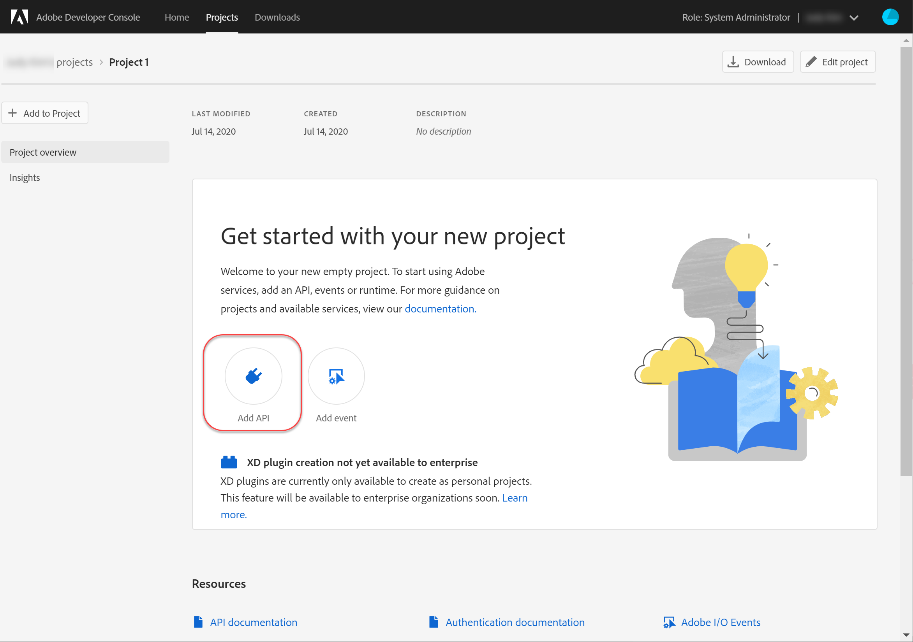
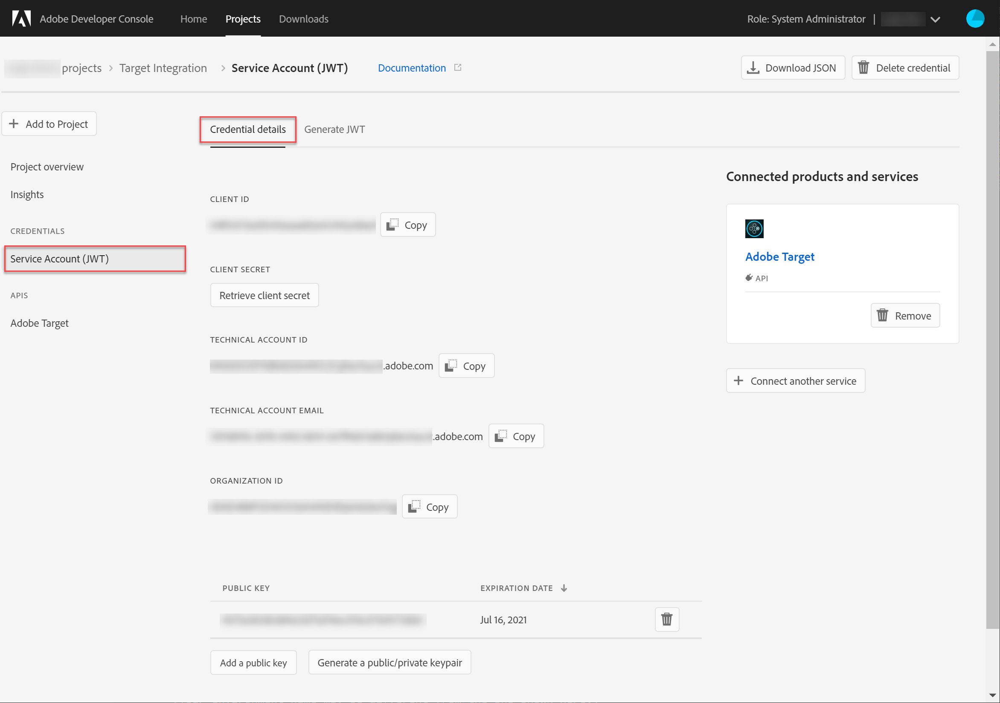
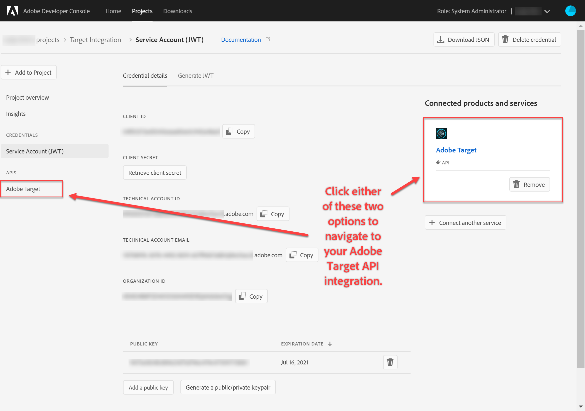
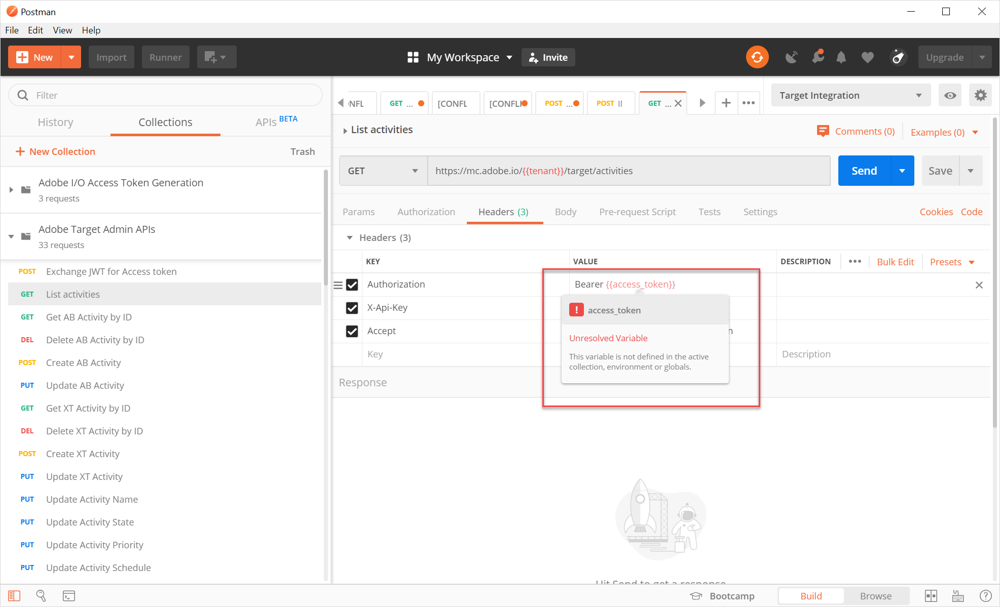

# Configurar autenticação para APIs Adobe Target

As Adobe Target Admin APIs, incluindo [!DNL Recommendations] Admin APIs, são protegidas por autenticação para garantir que somente usuários autorizados as usem para acessar o Adobe Target. Use o [Console do desenvolvedor do Adobe](https://console.adobe.io/) para gerenciar essa autenticação para todas as soluções Adobe Experience Cloud, incluindo [!DNL Target].

Esta lição percorre as etapas preliminares necessárias para gerar tokens de autenticação necessários para interagir com as APIs da Adobe Target. Nas seções a seguir, você:

1. Crie um projeto (anteriormente chamado de integração) no Adobe Developer Console.
2. Exporte detalhes do projeto para o Postman.
3. Gerar um token de acesso portador.
4. Teste o token de acesso do portador.

## Pré-requisitos

| Recurso | Detalhes |
| --- | --- |
| Postman | Para concluir essas etapas com êxito, obtenha o [aplicativo Postman](https://www.postman.com/downloads/) para seu sistema operacional. O Postman Basic é gratuito com a criação de contas. Embora não seja necessário para usar as APIs da Adobe Target em geral, o Postman facilita os workflows de API e a Adobe Target fornece várias coleções Postman para ajudar a executar suas APIs e aprender como elas operam. O resto deste tutorial assume conhecimento prático do Postman. Para obter assistência, consulte a [documentação do Postman](https://learning.getpostman.com/). |
| Referências | A familiaridade com os seguintes recursos é assumida durante todo o restante deste tutorial:<UL><li>[Adobe I/O Github](https://github.com/adobeio)</li><li>[Documentação do Público alvo Adobe I/O](https://developers.adobetarget.com/api/#introduction)</li><li>[Documentação da API do Recommendations](https://developers.adobetarget.com/api/recommendations/)</li></ul> |

## Criar um projeto da Adobe I/O

Nesta seção, você acessará o Console do desenvolvedor do Adobe e criará um projeto para [!DNL Adobe Target]. Para obter mais informações, consulte a documentação [sobre projetos](https://www.adobe.io/apis/experienceplatform/console/docs.html#!AdobeDocs/adobeio-console/master/projects.md).

<!--1. Generate your private key and public certificate, per the [documentation on authentication](https://www.adobe.io/authentication/auth-methods.html#!AdobeDocs/adobeio-auth/master/JWT/JWTCertificate.md). //<!--as described in **Step 1** of [How to set up Adobe IO: Authentication - Step by Step](https://helpx.adobe.com/marketing-cloud-core/kb/adobe-io-authentication-step-by-step.html). After completing Step 1, return to this tutorial and resume with Step 2, below. // The outcome of this step should be the creation of a `private.key` file and a `certificate_pub.crt` file. Return to this tutorial once you have generated these two files.-->

1. No [Adobe Admin Console](https://adminconsole.adobe.com/), certifique-se de que a sua conta de usuário do Adobe tenha recebido o acesso [Administrador do produto](https://helpx.adobe.com/enterprise/using/admin-roles.html) e [Desenvolvedor](https://helpx.adobe.com/enterprise/using/manage-developers.html) a [!DNL Target].

2. No console do desenvolvedor do Adobe [a1/>, selecione a Organização do Experience Cloud para a qual deseja criar essa integração. ](https://console.adobe.io/) (Observe que é provável que você só tenha acesso a uma única organização de Experience Cloud.)

   

3. Clique em **[!UICONTROL Criar novo projeto]**.

   

4. Clique em **[!UICONTROL Adicionar API]** para adicionar uma REST API ao seu projeto para acessar os serviços e produtos do Adobe.

   

5. Selecione **[!DNL Adobe Target]** como o serviço de Adobe com o qual você deseja integrar. Clique no botão **[!UICONTROL Next]** que é exibido.

   

6. Selecione uma opção para associar chaves públicas e privadas à integração da conta de serviço que você está criando para o Público alvo. Para este tutorial, selecione **[!UICONTROL Opção 1: Gere um par de teclas]** e clique em **[!UICONTROL Gerar par de teclas]**.
   

7. Observe os resultados! Conforme instruído, anote o arquivo de configuração automaticamente baixado (`config`), que contém sua chave privada. Clique em **[!UICONTROL Avançar]**.
   
8. No sistema de arquivos, verifique o local de `config`, que é o arquivo de configuração compactado criado na etapa anterior. Novamente, este arquivo `config` contém sua chave privada, que será necessária posteriormente. O local exato no seu sistema de arquivos pode ser diferente daquele mostrado aqui.
   
9. De volta ao Console do desenvolvedor do Adobe, selecione os [perfis de produto](https://helpx.adobe.com/enterprise/using/manage-products-and-profiles.html) correspondentes às propriedades em que você está usando [!DNL Recommendations]. (Se você não estiver usando propriedades, selecione a opção Espaço de trabalho padrão.) Clique em **[!UICONTROL Salvar API configurada]**.
   

10. Clique em **[!UICONTROL Criar integração]**. Você deve receber uma mensagem temporária indicando que sua API foi configurada com êxito.

11. Como etapa final, renomeie seu projeto para um nome mais significativo do que o `Project 1` original. Para fazer isso, navegue até o projeto usando o caminho de navegação como mostrado, clique em **[!UICONTROL Editar projeto]** para acessar o modal **[!UICONTROL Editar projeto] e renomeie o projeto.

>[!NOTE]
> 
>Neste tutorial, chamamos nosso projeto de &quot;Integração de Públicos alvos&quot;. Se você antecipar o uso do seu projeto para mais do que apenas a Adobe Target, poderá nomeá-lo de acordo. Por exemplo, você pode optar por nomeá-la como &quot;APIs de Adobe&quot; ou &quot;APIs de Experience Cloud,&quot; já que ela pode ser usada com outras soluções no Adobe Experience Cloud.

## Exportar detalhes do projeto

Agora que você tem um projeto Adobe que pode usar para acessar [!DNL Target], é necessário enviar detalhes do projeto junto com as solicitações de API do Adobe. Esses detalhes são necessários para interagir com várias APIs de Adobe, incluindo várias [!DNL Target] APIs. Por exemplo, os detalhes da integração incluem informações de autorização e autenticação exigidas pelas [!DNL Target] APIs administrativas. Portanto, para usar as APIs com o Postman, é necessário inserir esses detalhes no Postman.

Há muitas maneiras de especificar os detalhes de seu projeto no Postman, mas nesta seção, aproveitamos alguns recursos e coleções pré-criados. Primeiro (nesta seção), você exportará os detalhes de sua integração para um ambiente Postman. Em seguida (na seção a seguir), você gerará um token de acesso do portador para conceder acesso aos recursos de Adobe necessários.

>[!NOTE]
>
>Para obter instruções de vídeo aplicáveis a qualquer solução de Experience Cloud, incluindo [!DNL Target], consulte [Usar o Postman com APIs de Experience Platform](https://docs.adobe.com/content/help/en/platform-learn/tutorials/apis/postman.html). As seções a seguir são relevantes para as APIs [!DNL Target]:
>
> 1. Exportar detalhes de integração da Adobe I/O para o Postman
> 2. Gerar um Token de acesso com o Postman

>
> 
Essas etapas também são fornecidas a seguir.

1. Ainda no Console do desenvolvedor do Adobe [a1/>, navegue para visualização das credenciais **[!UICONTROL Service Account (JWT)]** do seu novo projeto. ](https://console.adobe.io/) Use a navegação à esquerda ou a seção **[!UICONTROL Credenciais]**, conforme mostrado.
   
Em detalhes **[!UICONTROL de]** credenciais, observe que você pode visualização em suas chaves  **públicas,** ID **do**cliente e outras informações relacionadas à sua conta de serviço.
   
2. Clique para navegar até as informações sobre a API **[!UICONTROL Adobe Target]**. Use a navegação à esquerda ou a seção **[!UICONTROL Produtos e serviços conectados]**, conforme mostrado.
   
3. Clique em **[!UICONTROL Baixar para Postman]** > **[!UICONTROL Conta de Serviço (JWT)]** para criar um arquivo JSON que capture as informações de autenticação para um ambiente Postman.
   
Anote o arquivo JSON em seu sistema de arquivos.
   
4. No Postman, clique no ícone de engrenagem para gerenciar seus ambientes, em seguida, clique em **Importar** para importar o arquivo JSON (ambiente).
   
5. Escolha seu arquivo e clique em **Abrir**.
   
6. No modal Postman **Gerenciar Ambientes**, clique no nome do ambiente recém-importado para inspecioná-lo. (O nome do seu ambiente pode ser diferente daquele mostrado aqui. Edite o nome conforme desejado. Ela não precisa necessariamente corresponder ao nome do projeto Adobe.)
   
7. Observe que `CLIENT_SECRET` e `API_KEY` (junto com outras variáveis) têm seus valores pré-preenchidos, extraídos da integração conforme definido no Console do desenvolvedor do Adobe. (A variável Postman `CLIENT_SECRET` deve corresponder à credencial `CLIENT SECRET` Adobe, conforme exibida no Developer Console, e `API_KEY` no Postman deve igualmente corresponder a `CLIENT ID` no Developer Console.) Por outro lado, as notas `PRIVATE_KEY`, `JWT_TOKEN` e `ACCESS_TOKEN` estão em branco. Vamos start fornecendo o valor `PRIVATE_KEY`.
   

   >[!NOTE]
   >
   >**Surpresa!**
   >
   >Teste de pop! Você consegue se lembrar onde está sua chave privada?
   >É isso mesmo, está no arquivo `config` baixado anteriormente do Adobe Developer Console!

8. No sistema de arquivos, abra o arquivo `config` e abra o arquivo de chave `private`.
   
9. Selecione e copie todo o conteúdo do arquivo de chave `private`.
   
10. No Postman, cole seu valor de chave privada nos campos **VALOR INICIAL** e **VALOR ATUAL**.
   
11. Clique em **[!UICONTROL Atualizar]** e feche o modal de Ambientes.

## Gerar o token de acesso do portador

Nesta seção, você gera seu token de acesso portador, que é necessário para autenticar sua interação com APIs da Adobe Target. Para gerar seu token de acesso portador, é necessário enviar seus detalhes de integração (estabelecidos nas seções anteriores) para o [Adobe Identity Management Service (IMS)](https://www.adobe.io/authentication/auth-methods.html#!AdobeDocs/adobeio-auth/master/AuthenticationOverview/AuthenticationGuide.md). Existem algumas maneiras diferentes de fazer isso, mas neste tutorial nós criamos uma solicitação de POST bespoke para a API IMS. Brincadeira. Neste tutorial, aproveitamos uma coleção Postman contendo uma chamada IMS pré-construída que torna o processo direto e fácil. Depois de importar a coleção, você pode reutilizá-la sempre que necessário para gerar novos tokens não apenas para Adobe Target, mas também para outras APIs de Adobe.

1. Navegue até [Chamadas de exemplo da API do Adobe Identity Management Service](https://github.com/adobe/experience-platform-postman-samples/tree/master/apis/ims).
   
2. Clique na coleção **Adobe I/O Token de acesso Generation Postman**.
   
3. Obtenha o JSON bruto para esta coleção clicando em **Raw** e, em seguida, copiando o JSON resultante para a área de transferência. (Como alternativa, você pode salvar o JSON bruto como um arquivo .json.)
   
4. No Postman, importe a coleção colando e enviando o JSON bruto da área de transferência. (Como alternativa, você pode carregar o arquivo .json que salvou.) Clique em **Continuar**.
   
5. Selecione **[!UICONTROL IMS: Solicitação JWT Generate + Auth via User Token]** na coleção Adobe I/O Token de acesso Generation Postman, verifique se o ambiente está selecionado e clique em **Send** para gerar o token.

   

   >[!NOTE]
   >
   >Este token de acesso portador será válido por 24 horas. Envie a solicitação novamente sempre que precisar gerar um novo token.

6. Abra o modal Gerenciar Ambientes novamente e selecione seu ambiente.
   
7. Observe que os valores `ACCESS_TOKEN` e `JWT_TOKEN` agora são preenchidos.
   

>[!NOTE]
>
>P: Preciso usar a coleção Postman de geração de Tokens de acesso Adobe I/O para gerar o JSON Web Token (JWT) e o token de acesso portador?
>
>A: Não! A coleção Postman de geração de Tokens de acesso Adobe I/O está disponível como uma conveniência para gerar mais facilmente o JWT e o token de acesso portador no Postman. Como alternativa, você pode usar os recursos no Console do desenvolvedor do Adobe para gerar manualmente o token de acesso do portador.

## Teste o token de acesso portador

Neste exercício, você usará seu novo token de acesso portador enviando uma solicitação de API que recupera uma lista do atividade da sua conta [!DNL Target]. Uma resposta bem-sucedida indica que seu projeto de Adobe e a autenticação estão funcionando como esperado para usar a API.

1. Importe a [Coleção Postman das APIs de administração do Adobe Target](https://developers.adobetarget.com/api/#admin-postman-collection). Siga todas as instruções até que a coleção seja importada no Postman.
   
1. Expanda a coleção e observe a solicitação **[!UICONTROL atividades de Lista]**.
   
1. Observe que variáveis como `{{access_token}}` estão inicialmente por resolver. Você pode resolver isso de várias maneiras diferentes, por exemplo, você pode definir uma nova variável de coleção chamada `{{access_token}}`, mas neste tutorial, você alterará a solicitação de API para aproveitar o ambiente Postman que estava usando anteriormente. Isso permitirá que o ambiente continue a servir como uma consolidação única e consistente de todas as variáveis comuns entre as APIs de Adobe.
   
1. Digite para substituir `{{access_token}}` por `{{ACCESS_TOKEN}}`.
   
1. Digite para substituir `{{api_key}}` por `{{API_KEY}}`.
   
1. Digite para substituir `{{tenant}}` por `{{TENANT_ID}}`. Observação `{{TENANT_ID}}` ainda não é reconhecida.
   
1. Abra o modal Gerenciar Ambientes e selecione seu ambiente.
   
1. Digite para adicionar uma nova variável de ambiente `{{TENANT_ID}}`. Copie e cole o valor da ID do locatário nos campos **VALOR INICIAL** e **VALOR ATUAL** para a nova variável de ambiente `TENANT_ID`.

   

   >[!NOTE]
   >
   >A ID do locatário é diferente de [!DNL Target] `clientcode`. A ID do locatário existe no URL quando você está conectado a [!DNL Target]. Para obter sua ID do locatário, faça logon no [!DNL Adobe Experience Cloud], abra [!DNL Target] e clique no cartão [!DNL Target]. Use o valor da ID do locatário, conforme observado no subdomínio do URL.
   >
   >Por exemplo, se seu URL quando conectado ao Adobe Target for
   >
   >`<https://mycompany.experiencecloud.adobe.com/...>`
   >
   >então sua ID do inquilino é &quot;minha empresa&quot;.

1. Envie sua solicitação depois de verificar se selecionou o ambiente correto. Você deve receber uma resposta contendo sua lista de atividades.
   

Parabéns! Agora que você verificou a autenticação do Adobe, pode usá-la para interagir com as APIs da Adobe Target (bem como outras APIs de Adobe). Por exemplo, você pode [Usar APIs do Recommendations](https://docs.adobe.com/content/help/en/target-learn/recommendations-api-tutorial/recs-api-overview.html) para criar ou gerenciar recomendações.
