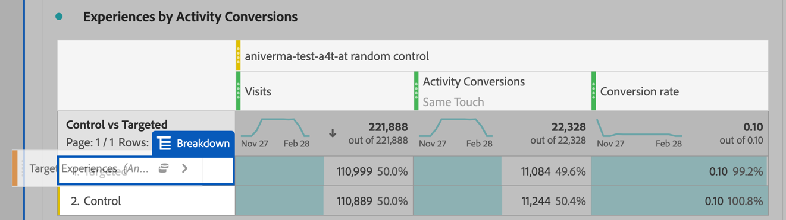

# Configuração de relatórios do A4T no Analysis Workspace para [!DNL Auto-Target] atividades

A integração do Analytics for Target (A4T) para o [!DNL Auto-Target] As atividades do usam os algoritmos de aprendizado de máquina (ML) do conjunto da Adobe Target para escolher a melhor experiência para cada visitante com base em seu perfil, comportamento e contexto, enquanto usam uma métrica de meta do Adobe Analytics.

Embora os recursos de análise avançada estejam disponíveis no Adobe Analytics Analysis Workspace, algumas modificações no padrão **[!UICONTROL Analytics para Target]** são necessários para interpretar corretamente o painel [!DNL Auto-Target] atividades, devido a diferenças entre as atividades de experimentação (A/B manual e Alocação automática) e as atividades de personalização ([!DNL Auto-Target]).

Este tutorial aborda as modificações recomendadas para analisar [!DNL Auto-Target] no Workspace, que se baseiam nos seguintes conceitos principais:

* O **[!UICONTROL Controle vs. Direcionado]** pode ser usada para distinguir entre as experiências de controle e as fornecidas pela variável [!DNL Auto-Target] algoritmo do conjunto ML.
* As Visitas devem ser usadas como a métrica de normalização ao visualizar detalhamentos de desempenho no nível da experiência. Além disso, [A metodologia de contagem padrão da Adobe Analytics pode incluir visitas em que o usuário não vê realmente o conteúdo da atividade](https://experienceleague.adobe.com/docs/target/using/integrate/a4t/a4t-faq/a4t-faq-viewing-reports.html?lang=en#metrics), mas esse comportamento padrão pode ser modificado usando um segmento com escopo apropriado (detalhes abaixo).
* A atribuição com escopo de retrospectiva de visita - também conhecida como &quot;janela de retrospectiva de visita&quot; no modelo de atribuição prescrito - é usada por modelos ML da Adobe Target durante suas fases de treinamento, e o mesmo modelo de atribuição (não padrão) deve ser usado ao detalhar a métrica de meta.

## Criar o A4T para [!DNL Auto-Target] painel no Workspace

Para criar um A4T para [!DNL Auto-Target] , comece com **[!UICONTROL Analytics para Target]** no Workspace, como mostrado abaixo, ou comece com uma tabela de forma livre. Em seguida, faça as seguintes seleções:

1. **[!UICONTROL Experiência de controle]**: Você pode escolher qualquer experiência; no entanto, você substituirá essa opção posteriormente. Observe que para [!DNL Auto-Target] , a experiência de controle é realmente uma estratégia de controle, que é a) Servir aleatoriamente entre todas as experiências ou b) Servir uma única experiência (essa escolha é feita no momento da criação da atividade no Adobe Target). Mesmo que você tenha optado pela escolha (b): [!DNL Auto-Target] atividade designada como Controle — você ainda deve seguir a abordagem descrita neste tutorial para analisar o A4T para [!DNL Auto-Target] atividades.
2. **[!UICONTROL Métrica de normalização]**: Selecione Visitas.
3. **[!UICONTROL Métricas de sucesso]**: Embora seja possível selecionar qualquer métrica para gerar relatórios, geralmente é necessário exibir relatórios sobre a mesma métrica escolhida para otimização durante a criação da atividade no Adobe Target.

*Figura 1: Configuração do painel do Analytics for Target para [!DNL Auto-Target] atividades.*

>[!NOTE]
>
>Para configurar o painel Analytics for Target para atividades de Direcionamento automático, escolha qualquer experiência de controle, escolha Visitas como a métrica de normalização e escolha a mesma métrica de meta que foi escolhida para otimização durante a criação da atividade do Target.

## Use a dimensão Controle versus Direcionado para comparar o modelo ML do conjunto da Adobe Target ao seu controle

O painel A4T padrão foi projetado para testes A/B clássicos (manuais) ou atividades de Alocação automática, onde o objetivo é comparar o desempenho de experiências individuais com a experiência de Controle. Em [!DNL Auto-Target] , no entanto, a primeira comparação de pedidos deve ser entre o Controle *estratégia* e o Target *estratégia* (em outras palavras, determinar o aumento do desempenho geral do [!DNL Auto-Target] modelo de conjunto ML sobre a estratégia de controle).

Para executar essa comparação, use o **[!UICONTROL Controle versus Direcionado (Analytics for Target)]** dimensão. Arraste e solte para substituir o **[!UICONTROL Experiências do Target]** no relatório A4T padrão.

Observe que essa substituição invalida os cálculos padrão de Aumento e Confiança no painel A4T. Para evitar confusão, você pode remover essas métricas do painel padrão, deixando o seguinte relatório:

*Figura 2: O relatório de linha de base recomendado para [!DNL Auto-Target] atividades. Este relatório foi configurado para comparar o tráfego Direcionado (servido pelo modelo ML do conjunto) com seu tráfego de Controle.*

>[!NOTE]
>
>Atualmente, os números de Lift e Confidence não estão disponíveis para as dimensões Control vs Targeted para os relatórios A4T para Direcionamento automático. Até que o suporte seja adicionado, o Aumento e a Confiança podem ser calculados manualmente ao baixar a variável [calculadora de confiança](https://experienceleague.adobe.com/docs/target/assets/complete_confidence_calculator.xlsx?lang=en).

## Adicionar detalhamentos de métricas no nível da experiência

Para obter mais informações sobre o desempenho do modelo ML do conjunto, você pode examinar os detalhamentos do nível da experiência do **[!UICONTROL Controle vs. Direcionado]** dimensão. No Workspace, arraste o **[!UICONTROL Experiências do Target]** no relatório e detalhe cada uma das dimensões de Controle e Direcionado separadamente.

*Figura 3: Detalhamento da dimensão Direcionada por experiências do Target*

Um exemplo do relatório resultante é mostrado aqui.

*Figura 4: Padrão [!DNL Auto-Target] com detalhamentos de nível de experiência. Observe que sua métrica de meta pode ser diferente, e sua estratégia de Controle pode ter uma única experiência.*

>[!TIP]
>
>No Workspace, clique no ícone de engrenagem para ocultar as Porcentagens na coluna Índice de conversão para ajudar a manter o foco nas taxas de conversão da experiência. Observe que as taxas de conversão serão formatadas como decimais, mas interprete-as como porcentagens de acordo.

## Por que &quot;Visitas&quot; é a métrica de normalização correta para [!DNL Auto-Target] atividades

Ao analisar uma [!DNL Auto-Target] sempre escolha Visitas como a métrica de normalização padrão. [!DNL Auto-Target] a personalização seleciona uma experiência para um visitante uma vez por visita (formalmente, uma vez por sessão do Adobe Target), o que significa que a experiência exibida para um usuário pode mudar em cada visita única. Assim, se você usar Visitantes únicos como a métrica de normalização, o fato de que um único usuário pode acabar visualizando várias experiências (em diferentes visitas) levaria a taxas de conversão confusas.

Um exemplo simples demonstra esse ponto: considere um cenário em que dois visitantes entram em uma campanha que tem apenas duas experiências. O primeiro visitante visita duas vezes. Eles são atribuídos à Experiência A na primeira visita, mas à Experiência B na segunda visita (devido ao estado do perfil ter mudado na segunda visita). Após a segunda visita, o visitante é convertido ao fazer um pedido. A conversão é atribuída à experiência exibida mais recentemente (Experiência B). O segundo visitante também visita duas vezes e a Experiência B é exibida duas vezes, mas nunca converte.

Vamos comparar os relatórios a nível de visitante e a nível de visita:

| Experiência | Visitantes únicos | Visitas | Conversões | Norma do visitante. Conv. Taxa | Norma de visita. Conv. Taxa |
| --- | --- | --- | --- | --- | --- |
| Um | 1 | 1 | - | 0% | 0% |
| B  | 2 | 3 | 1 | 50% | 33,3% |
| Totais | 2 | 4 | 1 | 50% | 25% |
*Quadro 1: Exemplo que compara relatórios normalizados de visitantes e relatórios normalizados de visitas para um cenário em que as decisões são aderentes a uma visita (e não a um visitante, como com testes A/B regulares). Métricas normalizadas do visitante são confusas nesse cenário.*

Conforme mostrado na tabela, há uma clara incongruência de números no nível do visitante. Apesar do fato de haver dois visitantes únicos totais, essa não é uma soma de visitantes únicos individuais para cada experiência. Embora a taxa de conversão no nível do visitante não esteja necessariamente errada, quando você compara experiências individuais, as taxas de conversão no nível da visita provavelmente fazem muito mais sentido. Formalmente, a unidade de análise (&quot;visitas&quot;) é a mesma que a unidade de decisão, o que significa que os detalhamentos das métricas no nível da experiência podem ser adicionados e comparados.

## Filtrar as visitas reais à atividade

A metodologia de contagem padrão do Adobe Analytics para visitas a uma atividade do Target pode incluir visitas em que o usuário não interagiu com a atividade do Target. Isso se deve à forma como as atribuições de atividade do Target são mantidas no contexto de visitante do Analytics. Como resultado, o número de visitas à atividade do Target pode, às vezes, ser inflado, resultando em uma depressão das taxas de conversão.

Se preferir relatar sobre visitas em que o usuário interagiu com a atividade de Direcionamento automático (por meio de uma entrada na atividade, um evento de exibição/visita ou uma conversão), é possível:

1. Crie um segmento específico que inclua ocorrências da atividade do Target em questão e
1. Filtre a métrica Visitas usando esse segmento.

**Para criar o segmento:**

1. Selecione o **[!UICONTROL Componentes > Criar segmento]** na barra de ferramentas do Workspace.
2. Insira um **[!UICONTROL Título]** para o seu segmento. No exemplo mostrado abaixo, o segmento é nomeado como [!DNL "Hit with specific Auto-Target activity"].
3. Arraste o **[!UICONTROL Atividades do Target]** dimensão ao segmento **[!UICONTROL Definição]** seção.
4. Use o **[!UICONTROL igual]** operador.
5. Procure sua atividade específica do Target.
6. Selecione o ícone de engrenagem e selecione **[!UICONTROL Modelo de atribuição > Instância]** conforme mostrado na figura abaixo.
7. Clique em **[!UICONTROL Salvar]**.

*Figura 5: Use um segmento como o mostrado aqui para filtrar a métrica Visitas no A4T para [!DNL Auto-Target] relatório*

Depois que o segmento tiver sido criado, use-o para filtrar a métrica Visitas, de modo que a métrica Visitas inclua apenas visitas onde o usuário interagiu com a atividade do Target.

**Para filtrar Visitas usando este segmento:**

1. Arraste o segmento recém-criado da barra de ferramentas dos componentes e passe o mouse sobre a base do **[!UICONTROL Visitas]** rótulo da métrica até um azul **[!UICONTROL Filtrar por]** for exibido.
2. Solte o segmento. O filtro será aplicado a essa métrica.

O painel final será exibido da seguinte maneira.

*Figura 6: Painel de relatórios com o segmento &quot;Ocorrência com atividade de direcionamento automático específica&quot; aplicado ao [!UICONTROL Visitas] métrica. Isso garante que somente as visitas em que um usuário interagiu com a atividade do Target em questão sejam incluídas no relatório.*

## Garanta que a métrica de meta e a atribuição estejam alinhadas ao seu critério de otimização

A integração A4T permite [!DNL Auto-Target]Modelo ML do *treinado* usando os mesmos dados de evento de conversão que o Adobe Analytics usa para *gerar relatórios de desempenho*. No entanto, há certos pressupostos que devem ser utilizados na interpretação destes dados na formação dos modelos ML, que diferem dos pressupostos predefinidos durante a fase de comunicação na Adobe Analytics.

Especificamente, os modelos ML da Adobe Target usam um modelo de atribuição com escopo de visitas. Ou seja, eles presumem que uma conversão deve ocorrer na mesma visita que uma exibição de conteúdo para a atividade, para que a conversão seja &quot;atribuída&quot; à decisão tomada pelo modelo ML. Tal é necessário para que o Target garanta a formação atempada dos seus modelos; O Target não pode esperar até 30 dias por uma conversão (a janela de atribuição padrão para relatórios no Adobe Analytics), antes de incluí-la nos dados de treinamento de seus modelos.

Assim, a diferença entre a atribuição usada pelos modelos do Target (durante o treinamento) e a atribuição padrão usada na consulta de dados (durante a geração do relatório) pode levar a discrepâncias. Pode até parecer que os modelos de ML têm um desempenho ruim, quando, de fato, o problema está na atribuição.

>[!TIP]
>
>Se os modelos de ML estão otimizando para uma métrica que é atribuída de forma diferente da métrica que você está visualizando em um relatório, os modelos podem não funcionar como esperado! Para evitar isso, assegure-se de que as métricas de meta em seu relatório usem a mesma definição de métrica e atribuição usadas pelos modelos ML do Target.

A definição exata de métrica e as configurações de atribuição dependem do [critério de otimização](https://experienceleague.adobe.com/docs/target/using/integrate/a4t/a4t-at-aa.html?lang=en#supported) você especificou durante a criação da atividade.

### Conversões definidas pelo Target ou métricas do Analytics com *Maximizar valor de métrica por visita*

Quando a métrica é uma conversão do Target ou uma métrica do Analytics com **Maximizar valor de métrica por visita**, a definição da métrica de meta permite que vários eventos de conversão ocorram na mesma visita.
Para visualizar métricas de meta que tenham a mesma metodologia de atribuição usada por modelos ML Adobe Target, siga estas etapas:

1. Passe o mouse sobre o ícone de engrenagem da métrica de meta:
   
1. No menu resultante, role até **[!UICONTROL Configurações de dados]**.
1. Selecionar **[!UICONTROL Usar modelo de atribuição não padrão]** (se ainda não estiver selecionado):
   
1. Clique em **[!UICONTROL Editar]**.
1. Selecionar **[!UICONTROL Modelo]**: **[!UICONTROL Participação]** e **[!UICONTROL Janela de pesquisa]**: **[!UICONTROL Visita]**.
   
1. Clique em **[!UICONTROL Aplicar]**.

Essas etapas garantem que seu relatório atribua a métrica de meta à exibição da experiência, se o evento de métrica de meta tiver ocorrido *qualquer hora* (&quot;participação&quot;) na mesma visita que uma experiência foi exibida.

### Métricas do Analytics com *Taxas de conversão de visita única*

**Definir a visita com o segmento de métrica positiva**

No cenário selecionado *Maximize a taxa de conversão de visitas exclusivas* como os critérios de otimização, a definição correta da taxa de conversão é a fração de visitas em que o valor da métrica é positivo. Isso pode ser feito criando uma filtragem de segmentos para visitas com um valor positivo da métrica e, em seguida, filtrando a métrica de visitas.

1. Como antes, selecione o **[!UICONTROL Componentes > Criar segmento]** na barra de ferramentas do Workspace.
2. Insira um **[!UICONTROL Título]** para o seu segmento. No exemplo mostrado abaixo, o segmento é nomeado como [!DNL "Visits with an order"].
3. Arraste a métrica base usada na meta de otimização para o segmento . No exemplo mostrado abaixo, usamos a variável **ordens** para que a taxa de conversão meça a fração de visitas em que um pedido é registrado.
4. Na parte superior esquerda do contêiner de definição de segmento, selecione **[!UICONTROL Incluir]** **Visita**.
5. Use o **[!UICONTROL é maior que]** e defina o valor como 0 (ou seja, este segmento inclui visitas em que a métrica de pedidos é positiva)
6. Clique em **[!UICONTROL Salvar]**.

*Figura 7: A filtragem da definição de segmento para visitas com uma ordem positiva. Dependendo da métrica de otimização da sua atividade, será necessário substituir os pedidos por uma métrica apropriada*

**Aplique isso às visitas na métrica filtrada de atividades**

Esse segmento agora pode ser usado para filtrar visitas com um número positivo de pedidos e onde houve uma ocorrência para a variável [!DNL Auto-Target]atividade . O procedimento de filtragem de uma métrica é semelhante a antes e depois de aplicar o novo segmento à métrica de visita já filtrada, o painel Relatório deve se parecer com a Figura 8

*Figura 8: O painel de relatórios com a métrica de conversão de visita única correta, ou seja, o número de visitas em que uma ocorrência da atividade foi registrada e em que a métrica de conversão (pedidos neste exemplo) era diferente de zero.*

## Etapa final: Crie uma taxa de conversão que capture a mágica acima

Com as modificações nas métricas de Visita e meta nas seções anteriores, a modificação final que você deve fazer no A4T padrão para [!DNL Auto-Target] o painel de relatórios é criar taxas de conversão que são a proporção correta, a da métrica de meta corrigida, para uma métrica de &quot;Visitas&quot; filtrada apropriadamente.

Faça isso criando uma Métrica calculada usando as seguintes etapas:

1. Selecione o **[!UICONTROL Componentes > Criar métrica]** na barra de ferramentas do Workspace.
1. Insira um **[!UICONTROL Título]** para sua métrica. Por exemplo, &quot;Taxa de conversão corrigida de visitas para a atividade XXX&quot;.
1. Selecionar **[!UICONTROL Formato]** = Porcentagem e **[!UICONTROL Casas decimais]** = 2.
1. Arraste a métrica de meta relevante para sua atividade (por exemplo, Conversões de atividade) para a definição e use o ícone de engrenagem nessa métrica de meta para ajustar o modelo de atribuição para (Participação|Visita), conforme descrito anteriormente.
1. Selecionar **[!UICONTROL Adicionar > Contêiner]** na parte superior direita do **[!UICONTROL Definição]** seção.
1. Selecione o operador de divisão ( pai) entre os dois contêineres.
1. Arraste o segmento criado anteriormente, chamado de &quot;Ocorrência com um segmento específico [!DNL Auto-Target] atividade&quot; neste tutorial — para este [!DNL Auto-Target] atividade .
1. Arraste o **[!UICONTROL Visitas]** no contêiner de segmento.
1. Clique em **[!UICONTROL Salvar]**.

>[!TIP]
>
> Também é possível criar essa métrica usando a [funcionalidade de métrica calculada rápida](https://experienceleague.adobe.com/docs/analytics-learn/tutorials/components/calculated-metrics/quick-calculated-metrics-in-analysis-workspace.html?lang=en).

A definição completa da métrica calculada é mostrada aqui.

*Figura 9: A definição de métrica de taxa de conversão do modelo corrigido de visitas e atribuições. (Observe que essa métrica depende da métrica de meta e da atividade. Em outras palavras, essa definição de métrica não é reutilizável em atividades do .)*

>[!IMPORTANT]
>
>A métrica Índice de conversão do painel A4T não está vinculada ao evento de conversão ou à métrica de normalização na tabela. Quando você faz as modificações sugeridas neste tutorial, a taxa de conversão não se adapta automaticamente às alterações. Portanto, se você fizer a modificação para uma (ou ambas) a atribuição do evento de conversão e a métrica de normalização, deverá lembrar como uma etapa final para também modificar a Taxa de conversão, conforme mostrado acima.

## Resumo: Painel Espaço de trabalho de amostra final para [!DNL Auto-Target] relatórios

Combinando todas as etapas acima em um único painel, a figura abaixo mostra uma visualização completa do relatório recomendado para [!DNL Auto-Target] Atividades do A4T. Este relatório é o mesmo usado pelos modelos de aprendizado de máquina do Target para otimizar sua métrica de meta, e incorpora todas as nuances e recomendações discutidas neste tutorial. Este relatório também está mais próximo das metodologias de contagem usadas nos relatórios tradicionais orientados pelo Target [!DNL Auto-Target] atividades.

*Figura 10: O A4T final [!DNL Auto-Target] no Adobe Analytics Workspace, que combina todos os ajustes nas definições de métrica descritas nas seções anteriores deste documento.*
