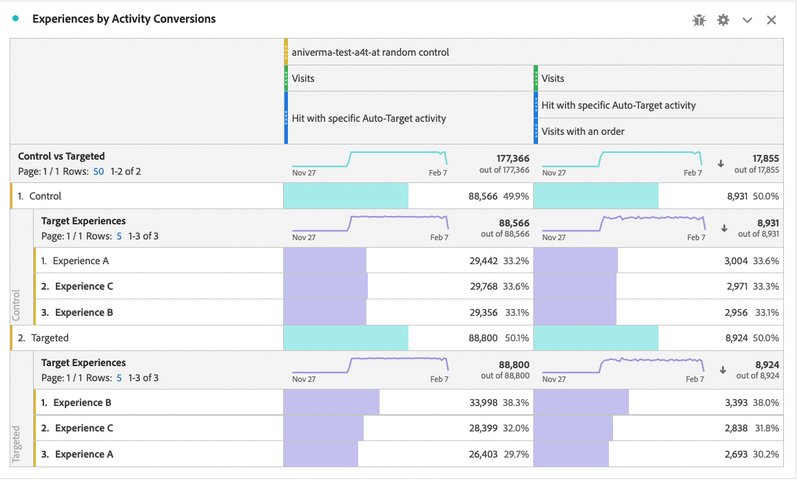

# Configurar relatórios do A4T em [!DNL Analysis Workspace] para [!DNL Auto-Target] atividades

>[!IMPORTANT]
>
>Para atividades de [!UICONTROL Direcionamento automático], você deve verificar os relatórios em [!DNL Analytics Workspace] e criar manualmente um painel A4T.

A integração do [!UICONTROL Analytics for Target] (A4T) para atividades [!DNL Auto-Target] usa os algoritmos de aprendizado de máquina (ML) do conjunto [!DNL Adobe Target] para escolher a melhor experiência para cada visitante com base em seu perfil, comportamento e contexto, tudo isso ao usar uma métrica de meta [!DNL Adobe Analytics].

Embora os recursos de análise avançada estejam disponíveis no [!DNL Adobe Analytics] [!DNL Analysis Workspace], algumas modificações no painel padrão **[!UICONTROL Analytics for Target]** são necessárias para interpretar corretamente as atividades de [!DNL Auto-Target], devido a diferenças entre as atividades de experimentação (teste A/B manual [!UICONTROL  e [!UICONTROL Alocação automática]) e as atividades de personalização ([!UICONTROL [!UICONTROL Direcionamento automático]]).]

Este tutorial aborda as modificações recomendadas para analisar atividades de [!UICONTROL Direcionamento automático] em [!DNL Analysis Workspace], que são baseadas nos seguintes conceitos principais:

* A dimensão **[!UICONTROL Controle vs. Direcionado]** pode ser usada para distinguir entre as experiências [!UICONTROL Controle] e as servidas pelo algoritmo de ML do conjunto [!UICONTROL Direcionamento automático].
* As Visitas devem ser usadas como a métrica de normalização ao visualizar detalhamentos de desempenho no nível de experiência. Além disso, a metodologia de contagem padrão do [Adobe Analytics pode incluir visitas em que o usuário não vê realmente o conteúdo da atividade](https://experienceleague.adobe.com/docs/target/using/integrate/a4t/a4t-faq/a4t-faq-viewing-reports.html#metrics){target=_blank}, mas esse comportamento padrão pode ser modificado usando um segmento com escopo apropriado (detalhes abaixo).
* A atribuição com escopo de retrospectiva de visita, também conhecida como &quot;janela de retrospectiva de visita&quot; no modelo de atribuição prescrito, é usada pelos modelos de ML [!DNL Adobe Target] durante suas fases de treinamento, e o mesmo modelo de atribuição (não padrão) deve ser usado ao detalhar a métrica de meta.

## Criar o A4T para o painel [!UICONTROL Direcionamento automático] em [!DNL Analysis Workspace]

Para criar um A4T para o relatório de [!UICONTROL Direcionamento automático], comece com o painel **[!UICONTROL Analytics for Target]** em [!DNL Analysis Workspace], como mostrado abaixo, ou comece com uma tabela de forma livre. Faça as seguintes seleções:

1. **[!UICONTROL Experiência de Controle]**: você pode escolher qualquer experiência; no entanto, substituirá essa opção mais tarde. Observe que para atividades de [!UICONTROL Direcionamento automático], a experiência de controle é realmente uma estratégia de controle, que pode ser a) Enviar aleatoriamente entre todas as experiências ou b) Enviar uma única experiência (essa escolha é feita no momento da criação da atividade em [!DNL Adobe Target]). Mesmo que você tenha optado pela opção (b), sua atividade [!UICONTROL de Direcionamento automático] designou uma experiência específica como controle. Você ainda deve seguir a abordagem descrita neste tutorial para analisar o A4T para atividades de [!UICONTROL Direcionamento automático].
2. **[!UICONTROL Métrica De Normalização]**: Selecione [!UICONTROL Visitas].
3. **[!UICONTROL Métricas de sucesso]**: embora seja possível selecionar qualquer métrica sobre a qual relatar, você geralmente deve exibir relatórios sobre a mesma métrica escolhida para otimização durante a criação da atividade em [!DNL Target].

   Configuração do painel ![[!UICONTROL Analytics for Target] para atividades de [!UICONTROL Direcionamento automático].](assets/Figure1.png)

   *Figura 1: Configuração do painel do [!UICONTROL Analytics for Target] para atividades de [!UICONTROL Direcionamento automático].*

>[!TIP]
>
>Para configurar o painel [!UICONTROL Analytics for Target] para atividades de [!UICONTROL Direcionamento automático], escolha qualquer experiência de controle, escolha [!UICONTROL Visitas] como a métrica de normalização e escolha a mesma métrica de meta que foi escolhida para otimização durante a criação da atividade [!DNL Target].

## Usar o [!UICONTROL Controle vs.Dimensão ] do Target para comparar o modelo de ML de conjunto [!DNL Target] com seu controle

O painel A4T padrão foi projetado para atividades clássicas (manuais) [!UICONTROL Teste A/B] ou [!UICONTROL Alocação automática]. A meta é comparar o desempenho de experiências individuais com a experiência de controle. No entanto, nas atividades de [!UICONTROL Direcionamento automático], a comparação de primeira ordem deve ser entre a *estratégia* de controle e a *estratégia* de destino. Em outras palavras, determinar o aumento do desempenho geral do modelo de ML de conjunto [!UICONTROL Direcionamento automático] sobre a estratégia de controle.

Para fazer essa comparação, use a dimensão **[!UICONTROL Controle versus Direcionado (Analytics for Target)]**. Arraste e solte para substituir a dimensão **[!UICONTROL Experiências do Target]** no relatório A4T padrão.

Observe que essa substituição invalida os cálculos padrão de [!UICONTROL Aumento e Confiança] no painel A4T. Para evitar confusão, é possível remover essas métricas do painel padrão, deixando o seguinte relatório:

![[!UICONTROL Experiências por conversões de atividade] no painel [!DNL Analysis Workspace]](assets/Figure2.png)

*Figura 2: O relatório de linha de base recomendado para [!DNL Auto-Target] atividades. Este relatório foi configurado para comparar o tráfego de destino (veiculado pelo modelo ML de conjunto) com o tráfego de controle.*

>[!NOTE]
>
>Atualmente, os números [!UICONTROL Elevação e Confiança] não estão disponíveis para as dimensões [!UICONTROL Controle versus Direcionado] dos relatórios A4T para [!UICONTROL Direcionamento automático]. Até que o suporte seja adicionado, o [!UICONTROL Aumento e Confiança] podem ser calculados manualmente baixando a [calculadora de confiança](https://experienceleague.adobe.com/docs/target/assets/complete_confidence_calculator.xlsx).

## Adicionar detalhamentos de métricas no nível de experiência

Para obter mais informações sobre o desempenho do modelo de ML de conjunto, você pode examinar detalhamentos no nível de experiência da dimensão **[!UICONTROL Controle vs. Direcionado]**. Em [!DNL Analysis Workspace], arraste a dimensão **[!UICONTROL Experiências do Target]** para o relatório e separe cada uma das dimensões de controle e de destino separadamente.

![[!UICONTROL Experiências por conversões de atividade] no painel [!DNL Analysis Workspace]](assets/Figure3.png)

*Figura 3: Analisando a dimensão de Destino por Experiências de Destino*

Um exemplo do relatório resultante é mostrado aqui.

![[!UICONTROL Experiências por conversões de atividade] no painel [!DNL Analysis Workspace]](assets/Figure4.png)

*Figura 4: Um relatório de [!UICONTROL Direcionamento automático] padrão com detalhamentos no nível da experiência. Observe que sua métrica de meta pode ser diferente e que sua estratégia de controle pode ter uma única experiência.*

>[!TIP]
>
>Em [!DNL Analysis Workspace], clique no ícone de engrenagem para ocultar as porcentagens na coluna [!UICONTROL Taxa de Conversão] para ajudar a manter o foco nas taxas de conversão da experiência. As taxas de conversão serão formatadas como decimais, mas serão interpretadas como porcentagens de acordo.

## Por que &quot;[!UICONTROL Visitas]&quot; é a métrica de normalização correta para [!UICONTROL Direcionamento automático] atividades

Ao analisar uma atividade de [!UICONTROL Direcionamento automático], sempre escolha [!UICONTROL Visitas] como métrica de normalização padrão. A personalização do [!UICONTROL Direcionamento automático] seleciona uma experiência para um visitante uma vez por visita (formalmente, uma vez a cada sessão [!DNL Target]), o que significa que a experiência mostrada para um visitante pode mudar em cada visita. Assim, se você usar [!UICONTROL Visitantes únicos] como a métrica de normalização, o fato de que um único usuário pode acabar vendo várias experiências (em diferentes visitas) levaria a taxas de conversão confusas.

Um exemplo simples demonstra esse ponto: considere um cenário em que dois visitantes entram em uma campanha que tem apenas duas experiências. O primeiro visitante visita duas vezes. Eles são atribuídos à Experiência A na primeira visita, mas à Experiência B na segunda visita (devido ao estado do perfil mudar nessa segunda visita). Após a segunda visita, o visitante se converte fazendo um pedido. A conversão é atribuída à experiência mostrada mais recentemente (Experiência B). O segundo visitante também visita duas vezes e aparece na Experiência B ambas as vezes, mas nunca converte.

Vamos comparar relatórios de nível de visitante e de nível de visita:

| Experiência | Visitantes únicos | Visitas | Conversões | Taxa de conversão normalizada pelo visitante | Índice de conversão normalizado de visita |
| --- | --- | --- | --- | --- | --- |
| Uma | 1 | 1 | - | 0% | 0% |
| B | 2 | 3 | 1 | 50% | 33.3% |
| Totais | 2 | 4 | 1 | 50% | 25% |

*Tabela 1: Exemplo comparando relatórios normalizados de visitantes e de visitas para um cenário em que as decisões são aderentes a uma visita (e não de visitantes, como no teste A/B regular). As métricas normalizadas pelo visitante são confusas neste cenário.*

Como mostrado na tabela, há uma clara incongruência entre os números de nível de visitante. Apesar do fato de haver dois visitantes únicos totais, essa não é uma soma de visitantes únicos individuais para cada experiência. Embora a taxa de conversão no nível do visitante não seja necessariamente incorreta, quando se compara experiências individuais, as taxas de conversão no nível da visita provavelmente fazem muito mais sentido. Formalmente, a unidade de análise (&quot;visitas&quot;) é a mesma que a unidade de aderência de decisão, o que significa que os detalhamentos de nível de experiência das métricas podem ser adicionados e comparados.

## Filtrar por visitas reais à atividade

A metodologia de contagem padrão [!DNL Adobe Analytics] para visitas a uma atividade [!DNL Target] pode incluir visitas em que o usuário não interagiu com a atividade [!DNL Target]. Isso se deve à forma como as atribuições de atividade [!DNL Target] são mantidas no contexto de visitante [!DNL Analytics]. Como resultado, o número de visitas à atividade [!DNL Target] pode, às vezes, ser aumentado, resultando em uma queda nas taxas de conversão.

Se você preferir relatar as visitas em que o usuário realmente interagiu com a atividade [!UICONTROL Direcionamento automático] (seja por meio da entrada na atividade, de um evento de exibição ou de visita ou de uma conversão), é possível:

1. Crie um segmento específico que inclua ocorrências da atividade [!DNL Target] em questão e
1. Filtrar a métrica [!UICONTROL Visitas] usando este segmento.

**Para criar o segmento:**

1. Selecione a opção **[!UICONTROL Componentes > Criar segmento]** na barra de ferramentas [!DNL Analysis Workspace].
2. Especifique um **[!UICONTROL Título]** para o seu segmento. No exemplo mostrado abaixo, o segmento é denominado [!DNL "Hit with specific Auto-Target activity"].
3. Arraste a dimensão **[!UICONTROL Atividades do Target]** para a seção **[!UICONTROL Definição]** do segmento.
4. Use o operador **[!UICONTROL igual]**.
5. Procure pela atividade [!DNL Target] específica.
6. Clique no ícone de engrenagem e selecione **[!UICONTROL Modelo de atribuição > Instância]** conforme mostrado na figura abaixo.
7. Clique em **[!UICONTROL Salvar]**.

![Segmento em [!DNL Analysis Workspace]](assets/Figure5.png)

*Figura 5: Use um segmento como o mostrado aqui para filtrar a métrica [!UICONTROL Visitas] no seu A4T para o relatório [!UICONTROL Direcionamento automático]*

Depois que o segmento for criado, use-o para filtrar a métrica [!UICONTROL Visitas], de modo que a métrica [!UICONTROL Visitas] inclua somente visitas em que o usuário interagiu com a atividade [!DNL Target].

**Para filtrar [!UICONTROL Visitas] usando este segmento:**

1. Arraste o segmento recém-criado da barra de ferramentas de componentes e passe o mouse sobre a base do rótulo da métrica **[!UICONTROL Visitas]** até que um prompt azul **[!UICONTROL Filtrar por]** seja exibido.
2. Libere o segmento. O filtro é aplicado a essa métrica.

O painel final é exibido da seguinte maneira:

![[!UICONTROL Experiências por conversões de atividade] no painel [!DNL Analysis Workspace]](assets/Figure6.png)

*Figura 6: Painel de relatórios com o segmento &quot;Ocorrência com atividade específica de Direcionamento automático&quot; aplicado à métrica [!UICONTROL Visitas]. Esse segmento garante que sejam incluídas no relatório somente as visitas em que um usuário realmente interagiu com a atividade [!DNL Target] em questão.*

## Verifique se a métrica de meta e a atribuição estão alinhadas com seu critério de otimização

A integração A4T permite que o modelo de ML do [!UICONTROL Direcionamento automático] seja *treinado* usando os mesmos dados de evento de conversão que o [!DNL Adobe Analytics] usa para *gerar relatórios de desempenho*. No entanto, há certas suposições que devem ser empregadas na interpretação desses dados ao treinar os modelos de aprendizado de máquina, que diferem das suposições padrão feitas durante a fase de relatórios no [!DNL Adobe Analytics].

Especificamente, os modelos de ML [!DNL Adobe Target] usam um modelo de atribuição com escopo de visita. Ou seja, os modelos de ML presumem que uma conversão deve ocorrer na mesma visita que uma exibição de conteúdo para a atividade para que a conversão seja &quot;atribuída&quot; à decisão tomada pelo modelo de ML. Isso é necessário para que o [!DNL Target] garanta o treinamento adequado de seus modelos; o [!DNL Target] não pode esperar até 30 dias por uma conversão (a janela de atribuição padrão para relatórios no [!DNL Adobe Analytics]) antes de incluí-lo nos dados de treinamento de seus modelos.

Assim, a diferença entre a atribuição usada pelos modelos [!DNL Target] (durante o treinamento) versus a atribuição padrão usada na consulta de dados (durante a geração do relatório) pode levar a discrepâncias. Pode até parecer que os modelos de ML estão tendo um desempenho ruim, quando, na verdade, o problema está na atribuição.

>[!TIP]
>
>Se os modelos de ML estiverem sendo otimizados para uma métrica atribuída de forma diferente das métricas que você está visualizando em um relatório, os modelos podem não funcionar conforme esperado. Para evitar isso, verifique se as métricas de meta do seu relatório usam a mesma definição e atribuição de métrica usadas pelos modelos de ML [!DNL Target].

A definição exata da métrica e as configurações de atribuição dependem do [critério de otimização](https://experienceleague.adobe.com/docs/target/using/integrate/a4t/a4t-at-aa.html#supported){target=_blank} especificado durante a criação da atividade.

### Conversões definidas pelo Target, ou [!DNL Analytics] métricas com *Maximizar valor de métrica por visita*

Quando a métrica é uma conversão de [!DNL Target] ou uma métrica de [!DNL Analytics] com **Maximizar valor de métrica por visita**, a definição da métrica de meta permite que vários eventos de conversão ocorram na mesma visita.

Para exibir métricas de meta que tenham a mesma metodologia de atribuição usada pelos modelos de ML [!DNL Target], siga estas etapas:

1. Passe o mouse sobre o ícone de engrenagem da métrica de meta:

   

1. No menu resultante, role até **[!UICONTROL Configurações de dados]**.
1. Selecione **[!UICONTROL Usar modelo de atribuição não padrão]** (se ainda não estiver selecionado).

   

1. Clique em **[!UICONTROL Editar]**.
1. Selecione **[!UICONTROL Modelo]**: **[!UICONTROL Participação]** e **[!UICONTROL Janela de pesquisa]**: **[!UICONTROL Visita]**.

   

1. Clique em **[!UICONTROL Aplicar]**.

Essas etapas garantem que seu relatório atribua a métrica de meta à exibição da experiência, se o evento da métrica de meta ocorrer *a qualquer momento* (&quot;participação&quot;) na mesma visita em que uma experiência foi exibida.

### [!DNL Analytics] métricas com *Taxas de conversão de visitas únicas*

**Definir a visita com segmento de métrica positivo**

No cenário em que você selecionou *Maximizar o Índice de conversão de visitas exclusivo* como critério de otimização, a definição correta do índice de conversão é a fração de visitas em que o valor da métrica é positivo. Isso pode ser feito criando uma filtragem de segmento para visitas com um valor positivo da métrica e filtrando a métrica de visitas.

1. Como antes, selecione a opção **[!UICONTROL Componentes > Criar segmento]** na barra de ferramentas [!DNL Analysis Workspace].
2. Especifique um **[!UICONTROL Título]** para o seu segmento.

   No exemplo mostrado abaixo, o segmento é denominado [!DNL "Visits with an order"].

3. Arraste a métrica base usada na sua meta de otimização para o segmento.

   No exemplo mostrado abaixo, usamos a métrica **pedidos**, para que a taxa de conversão meça a fração de visitas nas quais um pedido é registrado.

4. Na parte superior esquerda do contêiner de definição de segmento, selecione **[!UICONTROL Incluir]** **Visita**.
5. Use o operador **[!UICONTROL é maior que]** e defina o valor como 0.

   Definir o valor como 0 significa que esse segmento inclui visitas em que a métrica de pedidos é positiva.

6. Clique em **[!UICONTROL Salvar]**.

*Figura 7: filtragem da definição de segmento para visitas com uma ordem positiva. Dependendo da métrica de otimização da sua atividade, você deve substituir pedidos por uma métrica apropriada*

**Aplicar esta às visitas na métrica filtrada por atividade**

Esse segmento agora pode ser usado para filtrar para visitas com um número positivo de pedidos e onde houve uma ocorrência para a atividade [!DNL Auto-Target]. O procedimento de filtragem de uma métrica é semelhante ao anterior, e depois de aplicar o novo segmento à métrica de visita já filtrada, o painel de relatório deve ser semelhante à Figura 8

*Figura 8: o painel de relatórios com a métrica de conversão de visita única correta: o número de visitas em que uma ocorrência da atividade foi registrada e em que a métrica de conversão (pedidos neste exemplo) era diferente de zero.*

## Etapa final: crie uma taxa de conversão que capture a mágica acima

Com as modificações na [!UICONTROL Visita] e nas métricas de meta nas seções anteriores, a modificação final que você deve fazer no A4T padrão do painel de relatórios do [!DNL Auto-Target] é criar taxas de conversão que sejam a proporção correta, ou seja, a da métrica de meta corrigida, para uma métrica de &quot;Visitas&quot; filtrada adequadamente.

Faça isso criando uma [!UICONTROL Métrica calculada] usando estas etapas:

1. Selecione a opção **[!UICONTROL Componentes > Criar métrica]** na barra de ferramentas [!DNL Analysis Workspace].
1. Especifique um **[!UICONTROL Título]** para sua métrica. Por exemplo, &quot;Taxa de conversão corrigida de visita para a Atividade XXX&quot;.
1. Selecione **[!UICONTROL Formato]** = Porcentagem e **[!UICONTROL Casas decimais]** = 2.
1. Arraste a métrica de meta relevante para sua atividade (por exemplo, [!UICONTROL Conversões de atividade]) para a definição e use o ícone de engrenagem nesta métrica de meta para ajustar o modelo de atribuição para (Participação|Visita), conforme descrito anteriormente.
1. Selecione **[!UICONTROL Adicionar > Contêiner]** no canto superior direito da seção **[!UICONTROL Definição]**.
1. Selecione o operador de divisão () entre os dois contêineres.
1. Arraste o segmento criado anteriormente - chamado &quot;Ocorrência com atividade [!UICONTROL de Direcionamento automático] específica&quot; neste tutorial para esta atividade [!DNL Auto-Target] específica.
1. Arraste a métrica **[!UICONTROL Visitas]** para o contêiner de segmento.
1. Clique em **[!UICONTROL Salvar]**.

>[!TIP]
>
> Você também pode criar esta métrica usando a [funcionalidade de métrica calculada rápida](https://experienceleague.adobe.com/docs/analytics-learn/tutorials/components/calculated-metrics/quick-calculated-metrics-in-analysis-workspace.html).

A definição completa da métrica calculada é mostrada aqui.

*Figura 7: definição da métrica de taxa de conversão do modelo corrigida por visita e por atribuição. (Observe que essa métrica depende da sua métrica de meta e atividade. Em outras palavras, essa definição de métrica não é reutilizável em atividades.)*

>[!IMPORTANT]
>
>A métrica de taxa de [!UICONTROL Conversão] do painel A4T não está vinculada ao evento de conversão ou à métrica de normalização na tabela. Quando você faz as modificações sugeridas neste tutorial, a taxa de [!UICONTROL Conversão] não se adapta automaticamente às alterações. Portanto, se você fizer a modificação na atribuição do evento de conversão ou na métrica de normalização (ou ambas), deverá se lembrar como etapa final também modificar a taxa de [!UICONTROL Conversão], conforme mostrado acima.

## Resumo: Painel de amostra final [!DNL Analysis Workspace] para relatórios de [!UICONTROL Direcionamento automático]

Combinando todas as etapas acima em um único painel, a figura abaixo mostra uma exibição completa do relatório recomendado para atividades do A4T [!UICONTROL Direcionamento automático]. Este relatório é o mesmo usado pelos modelos de ML do [!DNL Target] para otimizar sua métrica de meta. O relatório incorpora todas as nuances e recomendações discutidas neste tutorial. Este relatório também é o mais próximo das metodologias de contagem usadas nas atividades tradicionais de [!UICONTROL Direcionamento automático] orientadas por [!DNL Target].

Clique para expandir a imagem.

![Relatório A4T final em [!DNL Analysis Workspace]](assets/Figure10.png "relatório A4T no Analysis Workspace"){width="600" zoomable="yes"}

*Figura 10: O relatório A4T [!UICONTROL Direcionamento automático] final em [!DNL Adobe Analytics] [!DNL Workspace], que combina todos os ajustes às definições de métrica descritos nas seções anteriores deste tutorial.*
