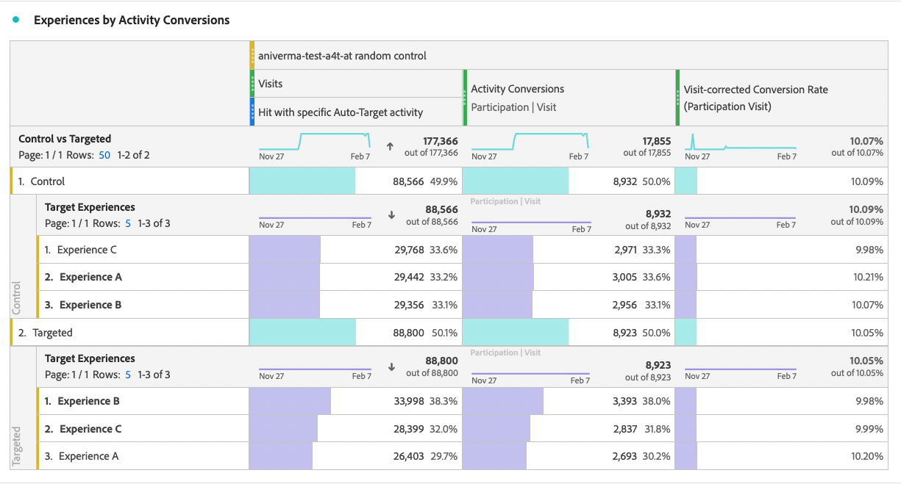

# Configuração de relatórios do A4T no [!DNL Analysis Workspace] para [!DNL Auto-Target] atividades

>[!NOTE]
>
>No momento, essa funcionalidade está na versão beta e estará disponível para todos [Target Premium](https://experienceleague.adobe.com/docs/target/using/introduction/intro.html?lang=en#premium){target=_blank} clientes em uma versão futura.

>[!IMPORTANT]
>
>Para [!UICONTROL Direcionamento automático] atividades, você deve fazer o check-in dos relatórios [!DNL Analytics Workspace] e crie manualmente um painel A4T.

A variável [!UICONTROL Analytics for Target] Integração do (A4T) para [!DNL Auto-Target] usos de atividades [!DNL Adobe Target]Os algoritmos de aprendizado de máquina (ML) do para escolher a melhor experiência para cada visitante com base em seu perfil, comportamento e contexto, tudo isso ao usar um [!DNL Adobe Analytics] métrica de meta.

Embora os recursos avançados de análise estejam disponíveis no [!DNL Adobe Analytics] [!DNL Analysis Workspace], algumas modificações no padrão **[!UICONTROL Analytics for Target]** para interpretar corretamente as [!DNL Auto-Target] atividades, devido a diferenças entre as atividades de experimentação (A/B manual e Alocação automática) e as atividades de personalização ([!UICONTROL Direcionamento automático]).

Este tutorial aborda as modificações recomendadas para análise [!UICONTROL Direcionamento automático] atividades no [!DNL Workspace], que se baseiam nos seguintes conceitos principais:

* A variável **[!UICONTROL Controle versus Direcionado]** dimensão pode ser usada para distinguir entre as experiências de controle e as atendidas pelo [!UICONTROL Direcionamento automático] Algoritmo de ML do conjunto.
* As Visitas devem ser usadas como a métrica de normalização ao exibir detalhamentos de desempenho no nível de experiência. Além disso, [A metodologia de contagem padrão do Adobe Analytics pode incluir visitas em que o usuário não vê realmente o conteúdo da atividade](https://experienceleague.adobe.com/docs/target/using/integrate/a4t/a4t-faq/a4t-faq-viewing-reports.html?lang=en#metrics), mas esse comportamento padrão pode ser modificado usando um segmento com escopo adequado (detalhes abaixo).
* A atribuição com escopo de retrospectiva de visita — também conhecida como &quot;janela de retrospectiva de visita&quot; no modelo de atribuição prescrito — é usada pelo [!DNL Adobe Target]Os modelos de aprendizado de máquina do durante as fases de treinamento e o mesmo modelo de atribuição (não padrão) devem ser usados ao detalhar a métrica de objetivo.

## Criar o A4T para [!UICONTROL Direcionamento automático] painel no [!DNL Workspace]

Para criar um A4T para [!UICONTROL Direcionamento automático] relatório, comece com a variável **[!UICONTROL Analytics for Target]** painel no [!DNL Workspace], conforme mostrado abaixo, ou comece com uma tabela de forma livre. Faça as seguintes seleções:

1. **[!UICONTROL Experiência de controle]**: você pode escolher qualquer experiência; no entanto, essa escolha será substituída posteriormente. Observe que para [!UICONTROL Direcionamento automático] atividades, a experiência de controle é realmente uma estratégia de controle, que é a) Servir aleatoriamente entre todas as experiências ou b) Servir uma única experiência (essa escolha é feita no momento da criação da atividade no [!DNL Adobe Target]). Mesmo que optasse pela escolha (b) — sua [!UICONTROL Direcionamento automático] A atividade designou uma experiência específica como Controle—você ainda deve seguir a abordagem descrita neste tutorial para analisar o A4T para [!UICONTROL Direcionamento automático] atividades.
2. **[!UICONTROL Métrica de normalização]**: selecione Visitas.
3. **[!UICONTROL Métricas de sucesso]**: Embora seja possível selecionar qualquer métrica sobre a qual relatar, você geralmente deve exibir relatórios na mesma métrica que foi escolhida para otimização durante a criação da atividade no [!DNL Target].

*Figura 1: [!UICONTROL Analytics for Target] configuração do painel para [!UICONTROL Direcionamento automático] atividades.*

>[!NOTE]
>
>Para configurar o seu [!UICONTROL Analytics for Target] painel para [!UICONTROL Direcionamento automático] atividades, escolha qualquer experiência de controle, escolha [!UICONTROL Visitas] como a métrica de normalização e escolha a mesma métrica de meta escolhida para otimização durante [!DNL Target] criação da atividade.

## Use o [!UICONTROL Controle versus Direcionado] dimensão para comparar a [!DNL Target] modelo ML conjunto para o seu controle

O painel A4T padrão foi projetado para testes A/B clássicos (manuais) ou [!UICONTROL Alocação automática] atividades em que o objetivo é comparar o desempenho de experiências individuais com a experiência de Controle. Entrada [!UICONTROL Direcionamento automático] atividades, no entanto, a comparação de primeira ordem deve ser entre as *estratégia* e o Target *estratégia* (por outras palavras, determinar o aumento do desempenho global do [!UICONTROL Direcionamento automático] conjunto (modelo ML sobre a estratégia de controle).

Para fazer essa comparação, use o **[!UICONTROL Controle versus Direcionado (Analytics for Target)]** dimensão. Arraste e solte para substituir o **[!UICONTROL Experiências do Target]** no relatório A4T padrão.

Observe que essa substituição invalida os cálculos padrão de aumento e confiança no painel A4T. Para evitar confusão, é possível remover essas métricas do painel padrão, deixando o seguinte relatório:

*Figura 2: O relatório de linha de base recomendado para [!DNL Auto-Target] atividades. Este relatório foi configurado para comparar o tráfego Direcionado (veiculado pelo modelo ML de conjunto) com o tráfego de Controle.*

>[!NOTE]
>
>Atualmente, os números de lift e confiança não estão disponíveis para [!UICONTROL Controle versus Direcionado] dimensões para relatórios do A4T para [!UICONTROL Direcionamento automático]. Até que o suporte seja adicionado, o aumento e a confiança podem ser calculados manualmente baixando o [calculadora de confiança](https://experienceleague.adobe.com/docs/target/assets/complete_confidence_calculator.xlsx?lang=en).

## Adicionar detalhamentos de métricas no nível da experiência

Para obter mais informações sobre o desempenho do modelo de aprendizado de máquina do conjunto, você pode examinar detalhamentos de nível de experiência do **[!UICONTROL Controle versus Direcionado]** dimensão. Entrada [!DNL Workspace], arraste o **[!UICONTROL Experiências do Target]** em seu relatório e, em seguida, analise cada uma das dimensões Controle e Segmentação separadamente.

*Figura 3: Detalhamento da dimensão de destino por experiências de destino*

Um exemplo do relatório resultante é mostrado aqui.

*Figura 4: Um padrão [!UICONTROL Direcionamento automático] relatório com detalhamentos de nível de experiência. Observe que sua métrica de meta pode ser diferente e que sua estratégia de controle pode ter uma única experiência.*

>[!TIP]
>
>Entrada [!DNL Workspace], clique no ícone de engrenagem para ocultar as Porcentagens no [!UICONTROL Índice de conversão] para ajudar a manter o foco nas taxas de conversão da experiência. Observe que as taxas de conversão serão formatadas como decimais, mas as interprete como porcentagens de acordo.

## Por que &quot;Visitas&quot; é a métrica de normalização correta para [!UICONTROL Direcionamento automático] atividades

Ao analisar uma [!UICONTROL Direcionamento automático] atividade, sempre escolha [!UICONTROL Visitas] como a métrica de normalização padrão. [!UICONTROL Direcionamento automático] a personalização seleciona uma experiência para um visitante uma vez por visita (formalmente, uma vez por [!DNL Adobe Target] ), o que significa que a experiência mostrada para um usuário pode mudar em cada visita. Assim, se você usar [!UICONTROL Visitantes únicos] como a métrica de normalização, o fato de que um único usuário pode acabar vendo várias experiências (em diferentes visitas) levaria a taxas de conversão confusas.

Um exemplo simples demonstra esse ponto: considere um cenário em que dois visitantes entram em uma campanha que tem apenas duas experiências. O primeiro visitante visita duas vezes. Eles são atribuídos à Experiência A na primeira visita, mas à Experiência B na segunda visita (devido ao estado do perfil mudar nessa segunda visita). Após a segunda visita, o visitante se converte fazendo um pedido. A conversão é atribuída à experiência mostrada mais recentemente (Experiência B). O segundo visitante também visita duas vezes e aparece na Experiência B ambas as vezes, mas nunca converte.

Vamos comparar relatórios de nível de visitante e de nível de visita:

| Experiência | Visitantes únicos | Visitas | Conversões | Norma do visitante. Conv Taxa | Visitar norma. Conv Taxa |
| --- | --- | --- | --- | --- | --- |
| Um | 1 | 1 | - | 0% | 0% |
| B  | 2 | 3 | 1 | 50% | 33.3% |
| Totais | 2 | 4 | 1 | 50% | 25% |

*Tabela 1: Exemplo comparando relatórios normalizados de visitantes e de visitas em um cenário em que as decisões são aderentes a uma visita (e não de visitantes, como no teste A/B regular). As métricas normalizadas pelo visitante são confusas neste cenário.*

Como mostrado na tabela, há uma clara incongruência entre os números de nível de visitante. Apesar do fato de haver dois visitantes únicos totais, essa não é uma soma de visitantes únicos individuais para cada experiência. Embora a taxa de conversão no nível do visitante não seja necessariamente incorreta, quando se compara experiências individuais, as taxas de conversão no nível da visita provavelmente fazem muito mais sentido. Formalmente, a unidade de análise (&quot;visitas&quot;) é a mesma que a unidade de aderência de decisão, o que significa que os detalhamentos de nível de experiência das métricas podem ser adicionados e comparados.

## Filtrar por visitas reais à atividade

A variável [!DNL Adobe Analytics] metodologia de contagem padrão para visitas a um [!DNL Target] atividade pode incluir visitas em que o usuário não interagiu com o [!DNL Target] atividade. Isso se deve ao modo como [!DNL Target] as atribuições de atividades são mantidas no [!DNL Analytics] contexto do visitante. Como resultado, o número de visitas à [!DNL Target] às vezes, a atividade pode ser inflada, resultando em uma redução das taxas de conversão.

Se preferir relatar as visitas em que o usuário realmente interagiu com o [!UICONTROL Direcionamento automático] atividade (seja por meio da entrada na atividade, de um evento de exibição/visita ou de uma conversão), você pode:

1. Crie um segmento específico que inclua ocorrências do [!DNL Target] atividade em questão e, em seguida,
1. Filtre o [!UICONTROL Visitas] usando esse segmento.

**Para criar o segmento:**

1. Selecione o **[!UICONTROL Componentes > Criar segmento]** opção no [!DNL Workspace] barra de ferramentas.
2. Insira um **[!UICONTROL Título]** para o seu segmento. No exemplo mostrado abaixo, o segmento é nomeado como [!DNL "Hit with specific Auto-Target activity"].
3. Arraste o **[!UICONTROL Atividades do Target]** dimensão ao segmento **[!UICONTROL Definição]** seção.
4. Use o **[!UICONTROL igual a]** operador.
5. Procure por sua [!DNL Target] atividade.
6. Selecione o ícone de engrenagem e selecione **[!UICONTROL Modelo de atribuição > Instância]** conforme mostrado na figura abaixo.
7. Clique em **[!UICONTROL Salvar]**.

*Figura 5: Use um segmento como o mostrado aqui para filtrar o [!UICONTROL Visitas] métrica no seu A4T para [!UICONTROL Direcionamento automático] relatório*

Depois que o segmento tiver sido criado, use-o para filtrar [!UICONTROL Visitas] , para que a [!UICONTROL Visitas] inclui somente visitas em que o usuário interagiu com a variável [!DNL Target] atividade.

**Para filtrar [!UICONTROL Visitas] usando este segmento:**

1. Arraste o segmento recém-criado da barra de ferramentas de componentes e passe o mouse sobre a base da **[!UICONTROL Visitas]** rótulo da métrica até um azul **[!UICONTROL Filtrar por]** será exibida.
2. Libere o segmento. O filtro será aplicado a essa métrica.

O painel final será exibido da seguinte maneira:

*Figura 6: Painel de relatórios com o segmento &quot;Ocorrência com atividade específica de direcionamento automático&quot; aplicado à [!UICONTROL Visitas] métrica. Isso garante somente visitas em que um usuário realmente interagiu com a [!DNL Target] atividade em questão estão incluídas no relatório.*

## Verifique se a métrica de meta e a atribuição estão alinhadas com seu critério de otimização

A integração A4T permite que o [!UICONTROL Direcionamento automático] Modelo de ML a ser *treinado* usar os mesmos dados de evento de conversão que [!DNL Adobe Analytics] usa para *gerar relatórios de desempenho*. No entanto, há certos pressupostos que devem ser utilizados na interpretação destes dados ao treinar os modelos de ML, que diferem dos pressupostos por defeito assumidos durante a fase de relato no [!DNL Adobe Analytics].

Especificamente, o [!DNL Adobe Target] Os modelos de ML usam um modelo de atribuição com escopo de visita. Ou seja, eles presumem que uma conversão deve ocorrer na mesma visita que uma exibição de conteúdo para a atividade, para que a conversão seja &quot;atribuída&quot; à decisão tomada pelo modelo ML. Isso é necessário para [!DNL Target] garantir a formação atempada dos seus modelos; [!DNL Target] O não pode aguardar até 30 dias para uma conversão (a janela de atribuição padrão para relatórios no [!DNL Adobe Analytics]), antes de incluí-lo nos dados de treinamento de seus modelos.

Assim, a diferença entre a atribuição utilizada [!DNL Target] Os modelos do (durante o treinamento) versus a atribuição padrão usada na consulta de dados (durante a geração do relatório) podem levar a discrepâncias. Pode até parecer que os modelos de ML estão tendo um desempenho ruim, quando, na verdade, o problema está na atribuição.

>[!TIP]
>
>Se os modelos de ML estiverem sendo otimizados para uma métrica atribuída de forma diferente das métricas que você está visualizando em um relatório, os modelos podem não funcionar conforme esperado! Para evitar isso, certifique-se de que as métricas de meta em seu relatório usem a mesma definição e atribuição de métrica usadas pelos modelos de aprendizado de máquina do Target.

A definição exata da métrica e as configurações de atribuição dependem do [critério de otimização](https://experienceleague.adobe.com/docs/target/using/integrate/a4t/a4t-at-aa.html?lang=en#supported) especificado durante a criação da atividade.

### Conversões definidas pelo Target ou métricas do Analytics com *Maximizar valor de métrica por visita*

Quando a métrica é uma conversão do Target ou uma métrica do Analytics com **Maximizar valor de métrica por visita**, a definição da métrica de meta permite que vários eventos de conversão ocorram na mesma visita.
Para visualizar métricas de meta que têm a mesma metodologia de atribuição usada pelos modelos de aprendizado de máquina do Adobe Target, siga estas etapas:

1. No menu resultante, role até **[!UICONTROL Configurações de dados]**.
1. Selecionar **[!UICONTROL Usar modelo de atribuição não-padrão]** (se ainda não estiver selecionado):

1. Clique em **[!UICONTROL Editar]**.
1. Selecionar **[!UICONTROL Modelo]**: **[!UICONTROL Participação]**, e **[!UICONTROL Janela de pesquisa]**: **[!UICONTROL Visita]**.

1. Clique em **[!UICONTROL Aplicar]**.

Essas etapas garantem que seu relatório atribuirá a métrica de meta à exibição da experiência, se o evento de métrica de meta tiver ocorrido *a qualquer momento* (&quot;participação&quot;) na mesma visita em que uma experiência foi mostrada.

### Métricas do Analytics com *Taxas de conversão de visitas únicas*

**Definir a visita com segmento de métrica positivo**

No cenário selecionado *Maximizar o índice de conversão de visitas únicas* como critério de otimização, a definição correta da taxa de conversão é a fração de visitas em que o valor da métrica é positivo. Isso pode ser feito criando uma filtragem de segmento para visitas com um valor positivo da métrica e filtrando a métrica de visitas.

1. Como antes, selecione o **[!UICONTROL Componentes > Criar segmento]** opção na barra de ferramentas do Workspace.
2. Insira um **[!UICONTROL Título]** para o seu segmento. No exemplo mostrado abaixo, o segmento é nomeado como [!DNL "Visits with an order"].
3. Arraste a métrica base usada na sua meta de otimização para o segmento . No exemplo mostrado abaixo, usamos a variável **pedidos** para que a taxa de conversão meça a fração de visitas em que um pedido é registrado.
4. Na parte superior esquerda do contêiner de definição de segmento, selecione **[!UICONTROL Incluir]** **Visita**.
5. Use o **[!UICONTROL é maior que]** e defina o valor como 0 (ou seja, esse segmento inclui visitas em que a métrica de pedidos é positiva)
6. Clique em **[!UICONTROL Salvar]**.

*Figura 7: A definição de segmento é filtrada para visitas com uma ordem positiva. Dependendo da métrica de otimização da sua atividade, será necessário substituir pedidos por uma métrica apropriada*

**Aplicar isso às visitas na métrica filtrada pela atividade**

Esse segmento agora pode ser usado para filtrar para visitas com um número positivo de pedidos e onde houve uma ocorrência para [!DNL Auto-Target]atividade. O procedimento de filtragem de uma métrica é semelhante ao anterior, e depois de aplicar o novo segmento à métrica de visita já filtrada, o painel de relatório deve ser semelhante à Figura 8

*Figura 8: O painel de relatórios com a métrica de conversão de visita única correta, ou seja, o número de visitas em que uma ocorrência da atividade foi registrada e em que a métrica de conversão (pedidos neste exemplo) era diferente de zero.*

## Etapa final: crie uma taxa de conversão que capture a mágica acima

Com as modificações no [!UICONTROL Visita] e métricas de meta nas seções anteriores, a modificação final que você deve fazer no seu A4T padrão para [!UICONTROL Direcionamento automático] O painel de relatórios deve criar taxas de conversão que sejam a proporção correta — a de uma métrica de meta com a atribuição correta, para uma taxa filtrada adequadamente [!UICONTROL Visitas] métrica.

Faça isso criando uma Métrica calculada usando as seguintes etapas:

1. Selecione o **[!UICONTROL Componentes > Criar métrica]** opção no [!DNL Workspace] barra de ferramentas.
1. Insira um **[!UICONTROL Título]** para sua métrica. Por exemplo, &quot;Taxa de conversão corrigida de visita para a Atividade XXX&quot;.
1. Selecionar **[!UICONTROL Formato]** = Percentual e **[!UICONTROL Casas decimais]** = 2.
1. Arraste a métrica de meta relevante para a sua atividade (por exemplo, [!UICONTROL Conversões de atividade]) na definição e use o ícone de engrenagem nesta métrica de objetivo para ajustar o modelo de atribuição a (Participação|Visita), conforme descrito anteriormente.
1. Selecionar **[!UICONTROL Adicionar > Contêiner]** na parte superior direita do **[!UICONTROL Definição]** seção.
1. Selecione o operador de divisão () entre os dois contêineres.
1. Arraste o segmento criado anteriormente - chamado de &quot;Ocorrência com propriedades [!UICONTROL Direcionamento automático] neste tutorial - para esta atividade específica [!DNL Auto-Target] atividade.
1. Arraste o **[!UICONTROL Visitas]** no contêiner de segmento.
1. Clique em **[!UICONTROL Salvar]**.

>[!TIP]
>
> Também é possível criar essa métrica usando a variável [funcionalidade de métrica calculada rápida](https://experienceleague.adobe.com/docs/analytics-learn/tutorials/components/calculated-metrics/quick-calculated-metrics-in-analysis-workspace.html?lang=en).

A definição completa da métrica calculada é mostrada aqui.

*Figura 9: A definição da métrica de taxa de conversão do modelo corrigida por visita e atribuição. (Observe que essa métrica depende da sua métrica de meta e atividade. Em outras palavras, essa definição de métrica não é reutilizável em atividades.)*

>[!IMPORTANT]
>
>A métrica Taxa de conversão do painel A4T não está vinculada ao evento de conversão ou à métrica de normalização na tabela. Ao fazer as modificações sugeridas neste tutorial, a Taxa de conversão não se adapta automaticamente às alterações. Portanto, se você fizer a modificação em uma (ou em ambas) a atribuição do evento de conversão e a métrica de normalização, deverá se lembrar como etapa final também modificar a Taxa de conversão, conforme mostrado acima.

## Resumo: amostra final [!DNL Workspace] painel para [!UICONTROL Direcionamento automático] relatórios

Combinando todas as etapas acima em um único painel, a figura abaixo mostra uma exibição completa do relatório recomendado para [!UICONTROL Direcionamento automático] Atividades do A4T. Este relatório é o mesmo que o utilizado pelo [!DNL Target] Modelos de aprendizado de máquina para otimizar sua métrica de objetivo, e incorpora todas as nuances e recomendações discutidas neste tutorial. O presente relatório está também mais próximo das metodologias de contagem [!DNL Target]orientado por relatórios [!UICONTROL Direcionamento automático] atividades.

*Figura 10: A versão final do A4T [!UICONTROL Direcionamento automático] relatório em [!DNL Adobe Analytics] [!DNL Workspace], que combina todos os ajustes às definições de métrica descritos nas seções anteriores deste documento.*
