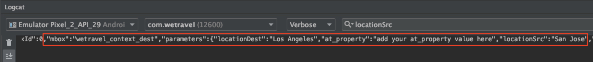

# Adicionar parâmetros às solicitações

Nesta lição, adicionaremos medições de ciclo de vida e parâmetros personalizados da Adobe às [!DNL Target] solicitações adicionadas na lição anterior. Essas métricas e parâmetros serão usados para criar audiências personalizadas posteriormente no tutorial.

## Objetivos de aprendizagem

Ao final desta lição, você poderá:

* Adicionar as métricas de ciclo de vida do Adobe Mobile
* Adicionar parâmetros a uma solicitação de busca prévia
* Adicionar parâmetros a um local ativo
* Validar os parâmetros para ambas as solicitações

## Adicionar os parâmetros de ciclo de vida

Vamos ativar as medições [de ciclo de vida do](https://docs.adobe.com/content/help/en/mobile-services/android/metrics.html)Adobe Mobile. Isso adicionará parâmetros a solicitações de localização que contêm informações avançadas sobre o dispositivo do usuário e o envolvimento com o aplicativo. Criaremos audiências na próxima lição usando os dados fornecidos pela solicitação do ciclo de vida.

Para ativar as medições de ciclo de vida, abra novamente o controlador HomeActivity e adicione-o `Config.collectLifecycleData(this);` à função onResume():


### Validar os parâmetros de ciclo de vida para a solicitação de pré-busca

Execute o Emulador e use o Logcat para validar os parâmetros do ciclo de vida. Filtre por &quot;busca prévia&quot; para localizar a resposta de busca prévia e procurar os novos parâmetros:


Mesmo que tenhamos adicionado apenas `Config.collectLifecycleData()` ao controlador HomeActivity, você também deve ver as medições de ciclo de vida enviadas com a solicitação de Público alvo na tela Obrigado.

## Adicionar o parâmetro at_property à solicitação de busca prévia

As Propriedades do Adobe Target são definidas na [!DNL Target] interface e são usadas para estabelecer limites para personalizar aplicativos e sites. O parâmetro at_property identifica a propriedade específica na qual suas ofertas e atividades são acessadas e mantidas. Adicionaremos uma propriedade às solicitações de busca prévia e de localização ativa.

>[!NOTE]
>
>Você pode ou não ver as opções Propriedades na [!DNL Target] interface, dependendo da sua licença. Se você não tiver essas opções, ou se não usar Propriedades na empresa, vá para a próxima seção desta lição.

Você pode recuperar o valor at_property na [!DNL Target] interface em [!UICONTROL Configuração] > [!UICONTROL Propriedades].  Passe o cursor do mouse sobre a propriedade, selecione o ícone do trecho de código e copie o `at_property` valor:


Adicione-o como um parâmetro para cada localização na solicitação de busca prévia, como esta:
at_propertyEste é o código atualizado para a `targetPrefetchContent()` função (certifique-se de atualizar o _[!UICONTROL seu valor at_property aqui]_é o texto do espaço reservado!):

```java
public void targetPrefetchContent() {
        List<TargetPrefetchObject> prefetchList = new ArrayList<>();

        Map<String, Object> params1;
        params1 = new HashMap<String, Object>();
        params1.put("at_property", "your at_property value goes here");

        prefetchList.add(Target.createTargetPrefetchObject(Constant.wetravel_engage_home, params1));
        prefetchList.add(Target.createTargetPrefetchObject(Constant.wetravel_engage_search, params1));
        Target.TargetCallback<Boolean> prefetchStatusCallback = new Target.TargetCallback<Boolean>() {
            @Override
            public void call(final Boolean status) {
                HomeActivity.this.runOnUiThread(new Runnable() {
                    @Override
                    public void run() {
                        String cachingStatus = status ? "YES" : "NO";
                        System.out.println("Received Response from prefetch : " + cachingStatus);
                        engageMessage();
                        setUp();

                    }
                });
            }};
        Target.prefetchContent(prefetchList, null, prefetchStatusCallback);
    }
```

### Observação sobre parâmetros

Para projetos futuros, você pode implementar parâmetros adicionais. O `createTargetPrefetchObject()` método permite três tipos de parâmetros: `locationParams`, `orderParams`e `productParams`. Consulte a documentação para obter [mais detalhes sobre como adicionar esses parâmetros à solicitação](https://docs.adobe.com/content/help/en/mobile-services/android/target-android/c-mob-target-prefetch-android.html)de busca prévia.

Observe também que diferentes parâmetros de localização podem ser adicionados a cada local na solicitação de busca prévia. Por exemplo, você pode criar outro Mapa chamado param2, colocar um novo parâmetro nele e, em seguida, definir param2 em um local e param1 com o outro local. Veja um exemplo:

```java
prefetchList.add(Target.createTargetPrefetchObject(location1_name, params1);
prefetchList.add(Target.createTargetPrefetchObject(location2_name, params2);
```

## Validar o parâmetro at_property na solicitação de busca prévia

Agora execute o emulador e use o Logcat para verificar se a propriedade at_está sendo exibida na solicitação de busca prévia e na resposta para ambos os locais:


## Adicionar Parâmetros Personalizados à Solicitação de Localização em Tempo Real

A solicitação de local ativo (weTravel_context_dest) foi adicionada na lição anterior para que pudéssemos exibir uma promoção relevante na tela de confirmação final do processo de reserva. Gostaríamos de personalizar a promoção com base no destino do usuário e, para isso, adicionaremos isso como parâmetro à solicitação. Também adicionaremos um parâmetro para a origem trop e o valor at_property.

Adicione os seguintes parâmetros à função targetLoadRequest() no controlador ObrigadoActivity:
Aqui está o código atualizado para a função targetLoadRequest() (atualize o texto do espaço reservado &quot;add your at_property value here&quot;!):

```java
public void targetLoadRequest(final ArrayList<Recommandation> recommandations) {
    Map<String, Object> locationParams = new HashMap<>();
    locationParams.put("at_property","add your at_property value here");
    locationParams.put("locationSrc", (""+Utility.getInSharedPreference(ThankYouActivity.this,Constant.departure,"")));
    locationParams.put("locationDest", (""+Utility.getInSharedPreference(ThankYouActivity.this,Constant.destination,"")));

    Target.loadRequest(Constant.wetravel_context_dest, "", null, null, locationParams, new Target.TargetCallback<String>() {
        @Override
        public void call(final String response) {
        try {
            runOnUiThread(new Runnable() {
                @Override
                public void run() {
                    AppDialogs.dialogLoaderHide();
                    filterRecommendationBasedOnOffer(recommandations, response);
                    recommandationbAdapter.notifyDataSetChanged();
                }
            });
        } catch (Exception e) {
            e.printStackTrace();
        }
        }
    });
    Target.clearPrefetchCache();
}
```

### Validar os Parâmetros Personalizados na Solicitação de Localização em Tempo Real

Execute o emulador e abra o Logcat. Filtre um dos parâmetros para verificar se a solicitação contém os parâmetros necessários:


>[!NOTE]
>
>Solicitações e parâmetros de confirmação de pedido: Embora não seja usado neste projeto de demonstração, os detalhes do pedido são geralmente capturados em uma implementação real para que [!DNL Target] possa usar os detalhes do pedido como métricas/dimensões. Consulte a documentação para obter instruções sobre como [implementar a solicitação de confirmação de pedido e os parâmetros](https://docs.adobe.com/content/help/en/mobile-services/android/target-android/c-target-methods.html).

>[!NOTE]
>
>Analytics for Target (A4T): O Adobe Analytics pode ser configurado como a fonte do relatórios para [!DNL Target]. Isso permite que todas as métricas/dimensões coletadas pelo SDK do Público alvo sejam visualizadas no Adobe Analytics. Consulte a Visão geral [do](https://docs.adobe.com/content/help/en/target/using/integrate/a4t/a4t.html) A4T para obter mais detalhes.

Bom trabalho! Agora que os parâmetros estão no lugar, estamos prontos para usar esses parâmetros para criar audiências e ofertas no Adobe Target.

**[PRÓXIMO : &quot;Criar Audiências e Ofertas&quot; >](create-audiences-and-offers.md)**
