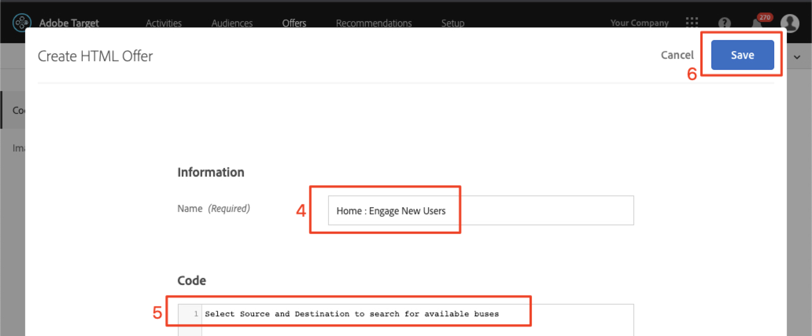
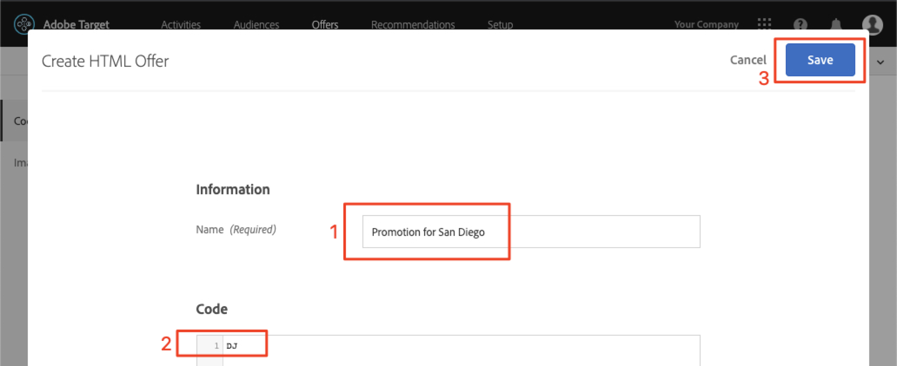

# Criar públicos e ofertas no Adobe Target

Nesta lição, entraremos na interface [!DNL Target] e criaremos públicos e ofertas para os três locais que implementamos nas lições anteriores.

## Learning Objectives

At the end of this lesson, you will be able to:

* Criar públicos-alvo no Adobe Target
* Create offers in Adobe Target

Mais especificamente, nesta lição, criaremos públicos e ofertas necessários para realizar os casos de uso de personalização definidos no início do tutorial. We want to use the Home and Search screens to help app users book their trips, and we want to use the Thank You screen to display some relevant promotions based on the user&#39;s destination. Esta é uma tabela que representa o que criaremos nesta lição para cada local:

| Localização | Público-alvo | Oferta |
| --- | --- | --- |
| weTravel_engagement_home | Novos usuários de aplicativos móveis | &quot;Selecione a Origem e o Destino para procurar as rotas de barramento disponíveis&quot; |
| web_training_search | Novos usuários de aplicativos móveis | &quot;Use filtros para restringir seus resultados de pesquisa&quot; |
| weTravel_engagement_home | Retornar usuários de aplicativos móveis | &quot;Bem-vindo de volta! Use promo code BACK30 during checkout to get a 10% discount.&quot; |
| web_training_search | Returning Mobile App Users | conteúdo padrão |
| wetravel_context_dest | Destino: San Diego | &quot;DJ&quot; |
| weTravel_context_dest | Destino: Los Angeles | &quot;Universal&quot; |

## Select Your Workspace

If your company uses Properties and Workspaces to establish boundaries for personalizing apps and websites—and you implemented the at_property parameter in the last lesson—you should first make sure that you are in the correct Workspace before proceeding with this lesson. Se você não usar Propriedades e espaços de trabalho, ignore esta etapa. Select the Workspace that you used in the previous lesson to copy the at_property value:

## Criar públicos-alvo

Agora vamos criar os públicos-alvo que usaremos para personalizar o aplicativo.

### Criar um público-alvo para novos usuários

Públicos-alvo da Adobe Target são usados para identificar grupos específicos de visitantes. As ofertas podem então ser direcionadas para esses grupos específicos. For the first two locations, we&#39;ll use a &quot;New Users&quot; audience:

1. Clique em **[!UICONTROL Públicos-alvo]** na navegação superior.
1. Clique no botão **[!UICONTROL Criar público-alvo]**.
   

1. Insira **[!UICONTROL New Mobile App Users]** como o nome do público.
1. Selecione **[!UICONTROL Adicionar Regra]**.
1. Selecione uma regra **[!UICONTROL Personalizada]**.
   

1. Selecione **[!UICONTROL a.Launches]**.
1. Select **[!UICONTROL is less than]**.
1. Insira **5**.
1. Salve o novo público.
   

### Criar um público-alvo para usuários recorrentes

Siga as mesmas etapas listadas acima para criar um público-alvo para usuários recorrentes.

1. Name the audience _Returning Mobile App Users_.
1. Use **[!UICONTROL a.Launches is greater than or equal to 5]** as the custom rule.
1. Save the new audience.

   

>[!NOTE]
>
>All Lifecycle metrics and dimensions collected in the [!DNL Target] mobile SDK are prepended with &quot;a&quot; (e.g., a.Launches) and are available in the &quot;Custom&quot; option of the drop-down menu and can be used to build audiences.

### Create an Audience for Users Booking a Trip to San Diego

Em seguida, criaremos alguns públicos-alvo para alguns dos destinos oferecidos pelo aplicativo We.Travel. Na última lição, passamos o destino como um parâmetro de localização na solicitação de local weTravel_context_dest. Esse parâmetro está disponível na opção &quot;Personalizado&quot; do menu suspenso.

>[!NOTE]
>
>Se um parâmetro que você espera ver na lista suspensa Personalizado não aparecer na interface [!DNL Target] , verifique novamente se ele está realmente sendo transmitido na solicitação. Se tiver verificado que está na solicitação, mas não foi carregado lentamente na interface [!DNL Target], você pode digitar o nome do parâmetro e pressionar Enter para continuar definindo seu público-alvo

1. Nomeie o público _Destino: San Diego_.
1. Use a custom rule with this definition: _locationDest contains San Diego_.
1. Save the new audience.

   

### Crie um público-alvo para usuários que estão reservando uma viagem para Los Angeles

1. Nomeie o público _Destino: Los Angeles_
1. Use uma regra personalizada com esta definição: _locationDest contém Los Angeles_
1. Salve o novo público.

## Crie ofertas

Agora, vamos criar ofertas para exibir essas mensagens. Como lembrete, as ofertas são trechos de código/conteúdo, que são fornecidos na resposta [!DNL Target]. Eles são criados com mais frequência na interface do usuário [!DNL Target], mas também podem ser criados por meio da API ou usando a integração dos Fragmentos de experiência com o Adobe Experience Manager. Em aplicativos móveis, as ofertas JSON são comuns. Neste tutorial, estaremos usando ofertas do HTML, que podem ser usadas para fornecer qualquer conteúdo de texto simples (incluindo JSON) ao aplicativo.

### Criar a oferta para novos usuários

Primeiro, vamos criar ofertas para as mensagens para novos usuários:

1. Clique em **[!UICONTROL Offers]** na navegação superior.
1. Clique em **[!UICONTROL Criar]**.
1. Selecione **[!UICONTROL HTML Offer]**.

   

1. Name the offer _Home: Engage New Users_.
1. Insira _Select Source and Destination para procurar os barramentos disponíveis_ como o código.
1. Salve a nova oferta.

   

### Create the Offer for Returning Users

Agora vamos criar a oferta única para usuários recorrentes (a segunda oferta será conteúdo padrão, que será exibido como nada):

1. Name the offer _Home: Returning Users_.
1. Digite _Bem-vindo de volta! Use o código promocional BACK30 durante o check-out para obter um desconto de 10%._ como o código HTML.
1. Save the new offer.

   

### Crie a oferta de San Diego

Quando &quot;DJ&quot; for retornado para a atividade ThankYou , a lógica na função filterRecommendationOnOffer() exibirá um banner para &quot;Rock Night with DJ SAM&quot;:

1. Dê um nome para a oferta _Promoção para San Diego_.
1. Enter _DJ_ as the HTML code.
1. Save the new offer.

### Criar oferta para usuários indo para Los Angeles

Quando &quot;Universal&quot; for retornado à atividade de Obrigado, a lógica na função filterRecommendationOnOffer() exibirá um banner para &quot;Universal Studios&quot; será exibida:

1. Nomeie a oferta como _Promoção para Los Angeles_.
1. Insira _Universal_ como o código HTML.
1. Salve a nova oferta.

## Conclusão 

Now we have our Audiences and Offers. Na próxima lição, criaremos atividades que unem os locais, públicos e ofertas para criar as experiências personalizadas!

**[NEXT : &quot;Personalize Layouts&quot; >](personalize-layouts.md)**
