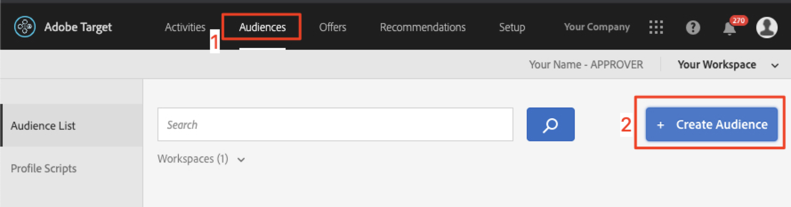

# Criar públicos e ofertas no Adobe Target

Nesta lição, nós entraremos na interface do [!DNL Target] e criaremos públicos-alvo e ofertas para os três locais que implementamos nas lições anteriores.

## Objetivos de aprendizagem

No final desta lição, você poderá:

* Criar públicos-alvo no Adobe Target
* Criar ofertas no Adobe Target

Mais especificamente, nesta lição, criaremos públicos e ofertas necessários para realizar os casos de uso de personalização definidos no início do tutorial. Queremos usar as telas Início e Pesquisa para ajudar os usuários do aplicativo a reservar suas viagens e queremos usar a tela Obrigado para exibir algumas promoções relevantes com base no destino do usuário. Esta é uma tabela que representa o que criaremos nesta lição para cada local:

| Localização | Público-alvo | Oferta |
| --- | --- | --- |
| wetravel_engage_home | Novos usuários de aplicativos móveis | &quot;Selecione sua origem e destino para procurar rotas de ônibus disponíveis&quot; |
| wetravel_engage_search | Novos usuários de aplicativos móveis | &quot;Usar filtros para restringir os resultados da pesquisa&quot; |
| wetravel_engage_home | Retornando usuários do aplicativo móvel | &quot;Bem-vindo de volta! Use o código promocional BACK30 durante o checkout para obter um desconto de 10%.&quot; |
| wetravel_engage_search | Retornando usuários do aplicativo móvel | conteúdo padrão |
| wetravel_context_dest | Destino: San Diego | &quot;DJ&quot; |
| wetravel_context_dest | Destino: Los Angeles | &quot;Universal&quot; |

## Selecione seu Workspace

Se sua empresa usa Propriedades e espaços de trabalho para estabelecer limites para personalizar aplicativos e sites e você implementou o parâmetro at_property na última lição, primeiro verifique se você está no Workspace correto antes de continuar com esta lição. Se você não usar Propriedades e Espaços de trabalho, basta ignorar esta etapa. Selecione o Workspace usado na lição anterior para copiar o valor at_property:

## Criar públicos-alvo

Agora vamos criar os públicos que usaremos para personalizar o aplicativo.

### Criar um público-alvo para novos usuários

Os públicos-alvo da Adobe Target são usados para identificar grupos específicos de visitantes. As ofertas podem então ser direcionadas para esses grupos específicos. Nos dois primeiros locais, usaremos um público-alvo de &quot;Novos usuários&quot;:

1. Clique em **[!UICONTROL Audiences]** na navegação superior.
1. Clique no botão **[!UICONTROL Create Audience]**.
   

1. Digite **[!UICONTROL New Mobile App Users]** como o nome do público-alvo.
1. Selecione **[!UICONTROL Add Rule]**.
1. Selecione uma regra **[!UICONTROL Custom]**.
   

1. Selecione **[!UICONTROL a.Launches]**.
1. Selecione **[!UICONTROL is less than]**.
1. Digite **5**.
1. Salve o novo público-alvo.
   

### Criar um público-alvo para usuários recorrentes

Siga as mesmas etapas listadas acima para criar um público-alvo para usuários recorrentes.

1. Nomeie o público-alvo _Usuários de Aplicativos Móveis Recorrentes_.
1. Use **[!UICONTROL a.Launches is greater than or equal to 5]** como regra personalizada.
1. Salve o novo público-alvo.

   

>[!NOTE]
>
>Todas as métricas e dimensões de ciclo de vida coletadas no SDK móvel [!DNL Target] são anexadas com &quot;a&quot; (por exemplo, a.Launches) e estão disponíveis na opção &quot;Personalizado&quot; do menu suspenso e podem ser usadas para criar públicos.

### Criar um público-alvo para usuários que reservam uma viagem a San Diego

Em seguida, criaremos alguns públicos para alguns dos destinos oferecidos pelo aplicativo We.Travel. Na última lição, passamos o destino como parâmetro de localização na solicitação de localização wetravel_context_dest. Esse parâmetro está disponível na opção &quot;Personalizado&quot; do menu suspenso.

>[!NOTE]
>
>Se um parâmetro que você espera ver na lista suspensa Personalizado não aparecer na interface [!DNL Target], verifique se ele está sendo transmitido na solicitação. Se você verificou que está na solicitação, mas não foi carregado lentamente na interface [!DNL Target], basta digitar o nome do parâmetro e pressionar Enter para continuar definindo seu público

1. Nomeie o público _Destino: San Diego_.
1. Use uma regra personalizada com esta definição: _locationDest contém San Diego_.
1. Salve o novo público-alvo.

   

### Criar um público-alvo para usuários que reservam uma viagem a Los Angeles

1. Nomeie o público _Destino: Los Angeles_
1. Use uma regra personalizada com esta definição: _locationDest contém Los Angeles_
1. Salve o novo público-alvo.

## Criar Ofertas

Agora, vamos criar ofertas para exibir essas mensagens. Lembrando que as ofertas são trechos de código/conteúdo, que são entregues na resposta do [!DNL Target]. Eles são criados com mais frequência na interface do usuário [!DNL Target], mas também podem ser criados por meio da API ou usando a integração de Fragmentos de experiência com o Adobe Experience Manager. Em aplicativos móveis, as ofertas JSON são comuns. Neste tutorial, usaremos as ofertas de HTML, que podem ser usadas para fornecer qualquer conteúdo de texto sem formatação (incluindo JSON) no aplicativo.

### Criar a oferta para novos usuários

Primeiro, vamos criar ofertas para as mensagens para Novos usuários:

1. Clique em **[!UICONTROL Offers]** na navegação superior.
1. Clique em **[!UICONTROL Create]**.
1. Selecione **[!UICONTROL HTML Offer]**.

   

1. Nomeie a oferta _Início: Envolver Novos Usuários_.
1. Digite _Selecionar Source e Destino para procurar barramentos disponíveis_ como código.
1. Salve a nova oferta.

   

### Criar a oferta para usuários recorrentes

Agora vamos criar uma oferta para usuários recorrentes (a segunda oferta será o conteúdo padrão, que será exibido como nada):

1. Nomeie a oferta _Início: Usuários Recorrentes_.
1. Digite _Bem-vindo de volta! Use o código promocional BACK30 durante o check-out para obter um desconto de 10%._ como o código HTML.
1. Salve a nova oferta.

   

### Criação da oferta em San Diego

Quando &quot;DJ&quot; for retornado à atividade ThankYou, a lógica na função filterRecommendationBasedOnOffer() exibirá um banner para &quot;Rock Night with DJ SAM&quot;:

1. Nomeie a oferta _Promoção para San Diego_.
1. Digite _DJ_ como o código de HTML.
1. Salve a nova oferta.

### Criar oferta para usuários que vão para Los Angeles

Quando &quot;Universal&quot; for retornado à atividade ThankYou, a lógica na função filterRecommendationBasedOnOffer() exibirá um banner para &quot;Universal Studios&quot; exibirá:

1. Nomeie a oferta _Promoção para Los Angeles_.
1. Digite _Universal_ como o código de HTML.
1. Salve a nova oferta.

## Conclusão 

Agora temos nossos Públicos-alvo e Ofertas. Na próxima lição, criaremos atividades que unem os locais, os públicos e as ofertas para criar as experiências personalizadas.

**[NEXT: &quot;Personalizar Layouts&quot; >](personalize-layouts.md)**
