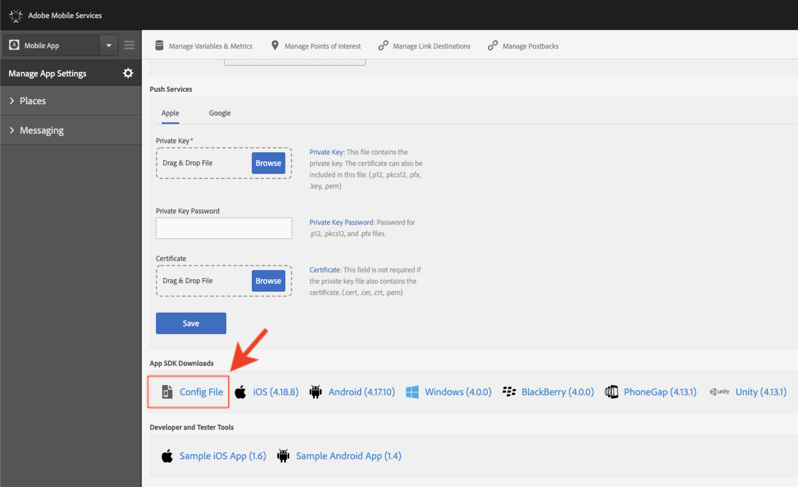
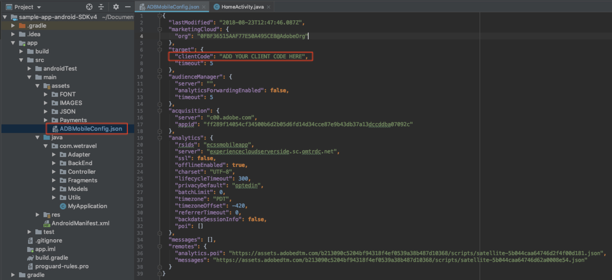

# Baixe e atualize o aplicativo de amostra We.Travel

O aplicativo de amostra We.Travel é pré-implementado com o SDK v4 do Adobe Mobile Services. Você só precisa atualizá-la para que ela aponte para suas próprias contas de Experience Cloud e de solução.

## Objetivos de aprendizagem

No final desta lição, você poderá:

* Baixe e abra o aplicativo de amostra We.Travel no Android Studio
* Verifique e atualize as configurações do SDK do Mobile Services para [!DNL Target]

## Baixe o aplicativo We.Travel

* Baixe o [sample-app-android-SDKv4-Base-Version.zip](assets/sample-app-android-SDKv4-Base-Version.zip)
* Descompacte o arquivo zip
* Abrir o aplicativo no Android Studio como um projeto existente (ignorar quaisquer erros sobre &quot;Mapeamento raiz VCS inválido&quot;)
* Execute o aplicativo em um emulador para confirmar que o aplicativo é criado e você pode ver a tela inicial
* Navegue no aplicativo e verifique se você pode concluir o processo de reserva (selecione qualquer opção de pagamento e pressione &quot;Continuar&quot; para ignorar a tela de faturamento!)

  

## Verifique e atualize as configurações do SDK do Mobile Services para [!DNL Target]

O SDK do Adobe Mobile Services foi pré-instalado no aplicativo We.Travel [de acordo com a documentação](https://experienceleague.adobe.com/docs/mobile-services/android/getting-started-android/requirements.html?lang=pt-BR). Agora você atualizará a instalação para apontar para sua própria conta [!DNL Target].

Primeiro, crie um novo aplicativo na interface do usuário do Mobile Services:

1. Faça logon na [interface do Adobe Mobile Services](https://mobilemarketing.adobe.com/).
1. Vá para o [!UICONTROL Manage Apps] e clique em **[!UICONTROL Add]** para adicionar um novo aplicativo para usar com este tutorial (**[!UICONTROL Manage Apps]** > **[!UICONTROL Add]**).
1. Escolha um conjunto de relatórios do Analytics com dados de não produção, dê um nome ao aplicativo, selecione o tipo **[!UICONTROL Standard]** e clique em **[!UICONTROL Save]**.
1. Depois que o aplicativo for adicionado, adicione o Código de Cliente do [!DNL Target] na próxima tela na seção [!UICONTROL SDK Target Options] (você pode encontrar o código de cliente na interface do [!DNL Target] em **[!UICONTROL Setup]** > **[!UICONTROL Implementation]** > **[!UICONTROL Edit Settings]**, ao lado do botão Baixar `at.js`).
1. A configuração [!UICONTROL Request Timeout] determina quanto tempo o aplicativo aguarda a resposta do servidor [!DNL Target] antes de executar as instruções de tempo limite. Basta deixar a configuração padrão.
1. Habilite o [!UICONTROL Visitor ID Service] e verifique se o [!UICONTROL Organization] está selecionado no menu suspenso.
1. Salve as alterações clicando em **[!UICONTROL Save]** no lado superior direito da janela (não o da seção [!UICONTROL Universal Links], [!UICONTROL App Links] ou [!UICONTROL Push Services]).
1. Role até a seção Downloads do SDK para aplicativos na parte inferior da página e baixe o Arquivo de configuração:

   

1. Substitua o arquivo `ADBMobileConfig.json` na pasta de ativos do projeto do Android Studio (aplicativo > src > main > assets).

1. Agora abra o arquivo `ADBMobileConfig.json` e verifique se ele contém as alterações esperadas, como o Código do Cliente [!DNL Target] e seus detalhes do Analytics:
   

Se você não vir suas configurações, confirme se clicou no botão direito **[!UICONTROL Save]** na interface [!UICONTROL Mobile Services] e copiou o arquivo para o local correto.

Parabéns! Você atualizou o SDK com os detalhes da sua conta do [!DNL Target]! Faremos a validação adicional da configuração depois que adicionarmos [!DNL Target] solicitações na próxima lição.

**[NEXT: &quot;Adicionar Solicitações de Destino&quot; >](add-requests.md)**
