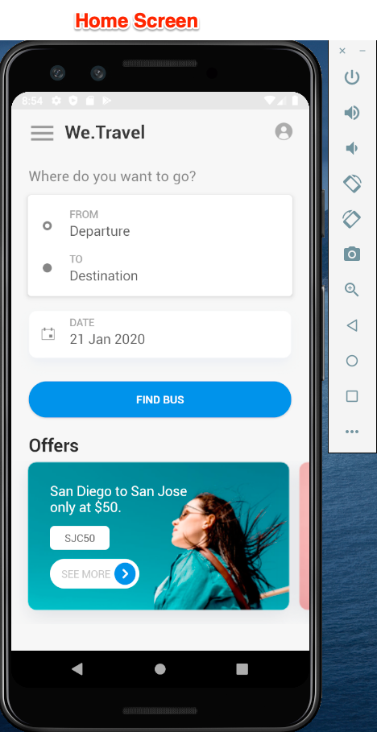

# Baixe e atualize o aplicativo de amostra We.Travel

O aplicativo de amostra We.Travel é pré-implementado com o SDK do Adobe Mobile Services v4. Você só precisa atualizá-la, para que ela aponte para suas próprias contas de Experience Cloud Org e solução.

## Objetivos de aprendizagem

Ao final desta lição, você poderá:

* Baixe e abra o aplicativo de amostra We.Travel no Android Studio
* Verificar e atualizar as configurações do SDK do Mobile Services para [!DNL Target]

## Baixe o aplicativo We.Travel

* Baixe o [exemplo-app-android-SDKv4-Base-Version.zip](assets/sample-app-android-SDKv4-Base-Version.zip)
* Descompacte o arquivo zip
* Abra o aplicativo no Android Studio como um projeto existente (ignore quaisquer erros sobre &quot;Mapeamento raiz VCS inválido&quot;)
* Execute o aplicativo em um emulador para confirmar que o aplicativo foi criado e que você pode ver a tela inicial
* Procure o aplicativo e verifique se você pode concluir o processo de reserva (selecione qualquer opção de pagamento e clique em &quot;Continuar&quot; para ignorar a tela de cobrança!)

   

## Verificar e atualizar as configurações do SDK do Mobile Services para [!DNL Target]

O SDK do Adobe Mobile Services foi pré-instalado no aplicativo We.Travel de [acordo com a documentação](https://docs.adobe.com/content/help/en/mobile-services/android/getting-started-android/requirements.html). Agora você atualizará a instalação para apontar para sua própria [!DNL Target] conta.

Primeiro, crie um novo aplicativo na interface do usuário do Mobile Services:

1. Log in to the [Adobe Mobile Services interface](https://mobilemarketing.adobe.com).
1. Vá para [!UICONTROL Gerenciar aplicativos]e clique em **[!UICONTROL Adicionar]** para adicionar um novo aplicativo a ser usado com este tutorial (**[!UICONTROL Gerenciar aplicativos]** > **[!UICONTROL Adicionar]**).
1. Escolha um conjunto de relatórios da Analytics com dados que não sejam de produção, dê um nome ao aplicativo, selecione o tipo **[!UICONTROL Padrão]** e clique em **[!UICONTROL Salvar]**.
1. Depois que o aplicativo for adicionado, adicione o Código do cliente na tela seguinte na seção Opções [!DNL Target] do Público alvo [!UICONTROL SDK (você pode encontrar o código do cliente na] interface em [!DNL Target] Configuração **[!UICONTROL >]** Implementação **[!UICONTROL >]** Editar configurações ****`at.js` , ao lado do botão Download).
1. A configuração Tempo limite [!UICONTROL da] solicitação determina quanto tempo o aplicativo aguarda a resposta do [!DNL Target] servidor antes de executar instruções de tempo limite. Deixe apenas a configuração padrão.
1. Ative o serviço [!UICONTROL de ID do] Visitante e verifique se a sua [!UICONTROL organização] está selecionada na lista suspensa.
1. Salve as alterações clicando em **[!UICONTROL Salvar]** no lado superior direito da janela (não no link [!UICONTROL Universal Links], nas opções de Links  de Aplicativo ou na seção Serviços [!UICONTROL de] push).
1. Role até a seção Downloads do SDK do aplicativo na parte inferior da página e baixe o arquivo de configuração:

   

1. Substitua o `ADBMobileConfig.json` arquivo na pasta de ativos do projeto do Android Studio (aplicativo > src > principal > ativos).

1. Agora, abra o `ADBMobileConfig.json` arquivo e verifique se ele contém as alterações esperadas, como seu Código do [!DNL Target] cliente e seus detalhes do Analytics:
   

Se não vir suas configurações, confirme que você clicou no botão **[!UICONTROL Salvar]** direito na interface do [!UICONTROL Mobile Services] e copiou o arquivo para o local correto.

Parabéns! Você atualizou o SDK com os detalhes de sua [!DNL Target] conta! A validação da configuração será realizada depois que adicionarmos [!DNL Target] solicitações na próxima lição.

**[PRÓXIMO : &quot;Adicionar solicitações de Público alvo&quot; >](add-requests.md)**
