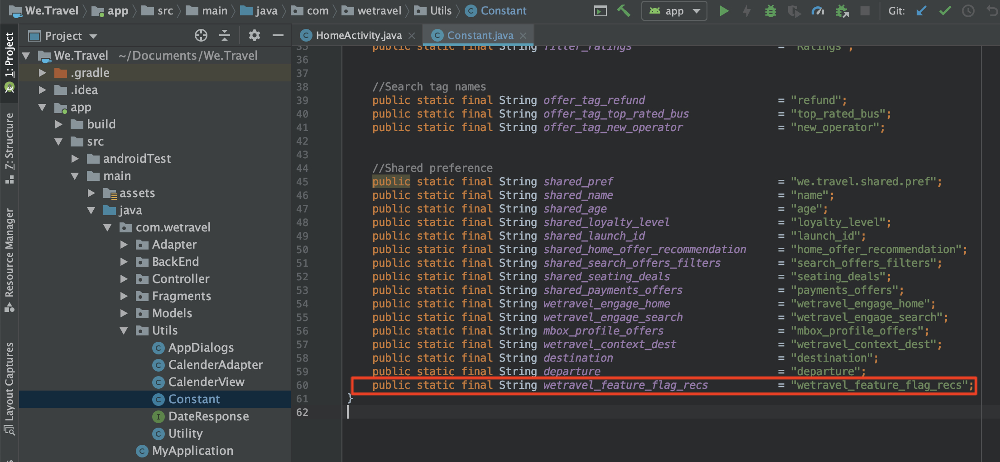

# Sinalização de recurso

Os proprietários de produtos de aplicativos móveis precisam da flexibilidade para implantar novos recursos em seus aplicativos sem precisar investir em várias versões de aplicativos. Eles também podem querer implantar recursos gradualmente em uma porcentagem da base de usuários para testar a eficácia. O Adobe Target pode ser usado para experimentar recursos de UX, como cor, cópia, botões, texto e imagens, e fornecer esses recursos a públicos específicos.

Nesta lição, criaremos uma oferta de &quot;sinalizador de recursos&quot; que pode ser usada como um acionador para habilitar recursos específicos do aplicativo.

## Objetivos de aprendizagem

No final desta lição, você poderá:

* Adicionar uma nova localização à solicitação de busca prévia de lote
* Crie uma atividade [!DNL Target] com uma oferta que será usada como sinalizador de recurso
* Carregue e valide a oferta de sinalizador de recursos no seu aplicativo

## Adicionar um novo local à solicitação de pré-busca para a atividade inicial

No aplicativo de demonstração de nossas lições anteriores, adicionaremos um novo local chamado &quot;wetravel_feature_flag_recs&quot; à solicitação de pré-busca na Atividade inicial e a carregaremos na tela com um novo método Java.

>[!NOTE]
>
>Um dos benefícios de usar uma solicitação de pré-busca é que a adição de uma nova solicitação não acrescenta sobrecarga de rede adicional nem causa trabalho de carga adicional, pois a solicitação é empacotada dentro da solicitação de pré-busca

Primeiro, verifique se a constante wetravel_feature_flag_recs foi adicionada ao arquivo Constant.java:



Este é o código:

```java
public static final String wetravel_feature_flag_recs = "wetravel_feature_flag_recs";
```

Agora adicione o local à solicitação de busca prévia e carregue uma nova função chamada `processFeatureFlags()`:


Este é o código atualizado completo:

```java
public void targetPrefetchContent() {
    List<TargetPrefetchObject> prefetchList = new ArrayList<>();

    Map<String, Object> params1;
    params1 = new HashMap<String, Object>();
    params1.put("at_property", "7962ac68-17db-1579-408f-9556feccb477");

    prefetchList.add(Target.createTargetPrefetchObject(Constant.wetravel_engage_home, params1));
    prefetchList.add(Target.createTargetPrefetchObject(Constant.wetravel_engage_search, params1));
    prefetchList.add(Target.createTargetPrefetchObject(Constant.wetravel_feature_flag_recs, params1));

    Target.TargetCallback<Boolean> prefetchStatusCallback = new Target.TargetCallback<Boolean>() {
        @Override
        public void call(final Boolean status) {
            HomeActivity.this.runOnUiThread(new Runnable() {
                @Override
                public void run() {
                    String cachingStatus = status ? "YES" : "NO";
                    System.out.println("Received Response from prefetch : " + cachingStatus);
                    engageMessage();
                    processFeatureFlags();
                    setUp();

                }
            });
        }};
    Target.prefetchContent(prefetchList, null, prefetchStatusCallback);
}

public void processFeatureFlags() {
    Target.loadRequest(Constant.wetravel_feature_flag_recs, "", null, null, null,
            new Target.TargetCallback<String>(){
                @Override
                public void call(final String s) {
                    runOnUiThread(new Runnable() {
                        @Override
                        public void run() {
                            System.out.println("Feature Flags : " + s);
                            if(s != null && !s.isEmpty()) {
                                //enable or disable features
                            }
                        }
                    });
                }
            });
}
```

### Validar a solicitação de sinalizador de recurso

Depois que o código for adicionado, execute o emulador na atividade inicial e observe o Logcat pela resposta atualizada:


## Criar um sinalizador de recurso Oferta JSON

Agora criaremos uma oferta JSON simples que atuará como um sinalizador ou acionador para um público específico, ou seja, o público que receberia a implantação do recurso no aplicativo. Na interface [!DNL Target], crie uma nova oferta:


Vamos nomeá-lo como &quot;Sinalizador de recurso v1&quot; com o valor {&quot;enable&quot;:1}


## Criar uma atividade

Agora vamos criar uma atividade de Teste A/B com essa oferta. Para obter etapas detalhadas sobre como criar uma atividade, consulte a lição anterior. A atividade só precisará de um público-alvo para este exemplo. Em um cenário em tempo real, talvez você queira criar públicos-alvo personalizados específicos para implantações de recursos específicos e, em seguida, definir a atividade para usar esses públicos-alvo. Neste exemplo, alocaremos apenas o tráfego 50/50 (50% para visitantes que veriam as atualizações de recursos e 50% para visitantes que veriam uma experiência padrão). Esta é a configuração da atividade:

1. Nomeie a atividade como &quot;Sinalizador de recurso&quot;
1. Selecione o local &quot;wetravel_feature_flag_recs&quot;
1. Altere o conteúdo para a oferta JSON &quot;Sinalizador de recurso v1&quot;

   

1. Clique em **[!UICONTROL Add Experience]** para adicionar a experiência B.
1. Deixe o local &quot;wetravel_feature_flag_recs&quot;
1. Deixar **[!UICONTROL Default Content]** para o conteúdo
1. Clique em **[!UICONTROL Next]** para avançar para a tela [!UICONTROL Targeting]

   

1. Na tela [!UICONTROL Targeting], verifique se o método [!UICONTROL Traffic Allocation] está definido com a configuração padrão (Manual) e se cada experiência tem a alocação padrão de 50%. Selecione **[!UICONTROL Next]** para avançar para **[!UICONTROL Goals & Settings]**.

   

1. Defina o **[!UICONTROL Primary Goal]** como **[!UICONTROL Conversion]**.
1. Defina a ação como **[!UICONTROL Viewed an Mbox]**. Usaremos o local &quot;wetravel_context_dest&quot; (como esse local está na tela Confirmação, podemos usá-lo para ver se o novo recurso leva a mais conversões).
1. Clique em **[!UICONTROL Save & Close]**.

   

Ativar a atividade.

## Validar a atividade do sinalizador de recurso

Agora use o emulador para observar a solicitação. Como definimos o direcionamento para 50% dos usuários, há 50% de você verá que a resposta do sinalizador de recurso contém o valor `{enable:1}`.


Se você não vir o valor `{enable:1}`, significa que não foi direcionado para a experiência. Como teste temporário, para forçar a exibição da oferta, você pode:

1. Desative a atividade.
1. Altere a alocação de tráfego para 100% na nova experiência de recurso.
1. Salve e reative.
1. Apague os dados no emulador e reinicie o aplicativo.
1. A oferta agora deve retornar o valor `{enable:1}`.

Em um cenário em tempo real, a resposta do `{enable:1}` pode ser usada para habilitar mais lógica personalizada no aplicativo para exibir o conjunto de recursos específico que você deseja mostrar ao público-alvo.

## Conclusão 

Bom trabalho! Agora você tem as habilidades necessárias para implantar recursos em públicos-alvo de usuário específicos.
