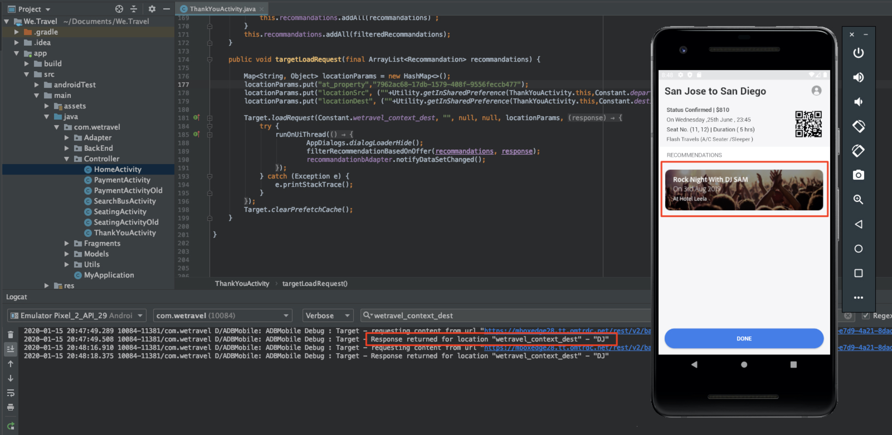

# Personalizar layouts

Agora é hora de reunir tudo e criar as experiências personalizadas. Uma _Atividade_ é o mecanismo [!DNL Target] que vincula os locais, públicos e ofertas, de modo que, quando a solicitação for feita a partir do aplicativo, [!DNL Target] responda com o conteúdo personalizado. Criaremos duas atividades de personalização em [!DNL Target] e validaremos que o conteúdo personalizado seja exibido ao usuário certo na hora certa e no local certo.

## Objetivos de aprendizagem

Ao final desta lição, você poderá:

* Criar atividades no Adobe Target
* Validar as atividades no aplicativo de amostra

## Criar atividades no Adobe Target

Saiba como criar atividades Engage Users and Contextual Offers .

### Primeira atividade - &quot;Mobilizar usuários&quot;

Este é um resumo da atividade que criaremos:

| Público-alvo | Localizações | Ofertas |
|---|---|---|
| Novos usuários de aplicativos móveis | weTravel_engagement_home, weTravel_engagement_search | Início: Envolver novos usuários, Pesquisar: Envolver novos usuários |
| Retornar usuários de aplicativos móveis | weTravel_engagement_home, weTravel_engagement_search | Início: Retornando usuários, default_content |

Na interface [!DNL Target], faça o seguinte:

1. Selecione **[!UICONTROL Atividades]** > **[!UICONTROL Criar Atividade]** > **[!UICONTROL Direcionamento de Experiência]**.

   

1. Clique em **[!UICONTROL Aplicativo Móvel]**.
1. Selecione o **[!UICONTROL Compositor de formulário]**.
1. Selecione seu espaço de trabalho (o mesmo espaço de trabalho que você usou nas lições anteriores).
1. Selecione sua Propriedade (a mesma propriedade que você usou nas lições anteriores).
1. Clique em **[!UICONTROL Avançar]**.

   

1. Altere o título da atividade para **[!UICONTROL Envolver usuários]**.
1. Selecione o **[!UICONTROL elipse]** > **[!UICONTROL Alterar público-alvo]**.
   
1. Defina o público como **[!UICONTROL Novos usuários do aplicativo móvel]**.
1. Clique em **[!UICONTROL Concluído]**.
   

1. Altere o local para _weTravel_engagement_home_.
1. Selecione a seta suspensa ao lado de Conteúdo padrão e selecione **[!UICONTROL Alterar oferta de HTML]**.

   

1. Selecione o **[!UICONTROL Início: Envolva a oferta Novos Usuários]**.
1. Selecione **[!UICONTROL Concluído]**.

   

1. Selecione **[!UICONTROL Adicionar Localização]**.
   

1. Selecione o local _weTravel_engagement_search_.
1. Altere a HTML offer.

   

1. Selecione o **[!UICONTROL Procurar: Envolva a oferta Novos Usuários]**.
1. Clique em **[!UICONTROL Concluído]**.

   

Você acabou de conectar um público-alvo a locais e ofertas, criando a experiência personalizada para os novos usuários de aplicativos móveis! A experiência agora deve ser semelhante a esta:

Agora crie uma experiência para retornar usuários do aplicativo móvel:

1. Selecione **[!UICONTROL Adicionar Direcionamento de experiência]** à esquerda.
1. Selecione o público-alvo **[!UICONTROL que retorna usuários de aplicativos móveis]**.
1. Selecione **[!UICONTROL Concluído]**.
   

Agora use o mesmo processo que usamos anteriormente para configurar a nova experiência. A configuração da experiência Retornar usuários de aplicativos móveis deve ser semelhante a:

Vamos continuar para a próxima tela na configuração:

1. Clique em **[!UICONTROL Avançar]** para avançar para a tela **[!UICONTROL Direcionamento]**.
1. Use as configurações padrão para Direcionamento. Se você tiver experiências para públicos-alvo que se sobrepuseram (por exemplo, _New York Users_ e _First Time Users_) você pode organizar a ordem de prioridade nesta tela.
1. Clique em **[!UICONTROL Avançar]** para avançar para **[!UICONTROL Metas e configurações]**.

   

Agora vamos concluir a configuração da atividade:

1. Defina a **[!UICONTROL Meta primária]** para **[!UICONTROL Conversão]**.
1. Defina a ação para **[!UICONTROL Visualizada uma mbox]** > _weTravel_context_dest_ (Como essa localização está na tela de confirmação, podemos usá-la para medir as conversões).

   

1. Mantenha todas as outras configurações na tela com os padrões.
1. Clique em **[!UICONTROL Salvar e fechar]** para salvar a atividade.
1. Ative a **[!UICONTROL Atividade]** na próxima tela.

Nossa primeira atividade agora está pronta para ser testada!

### Segunda atividade - &quot;Ofertas contextuais&quot;

Este é um resumo da segunda atividade que criaremos:

| Público-alvo | Localização | Ofertas |
| --- | --- | --- |
| Destino: San Diego | weTravel_context_dest | Promoção de San Diego |
| Destino: Los Angeles | weTravel_context_dest | Promoção para Los Angeles |

Repita o mesmo processo descrito acima para a próxima Atividade - &quot;Ofertas contextuais&quot;. A configuração final de ambas as experiências é mostrada abaixo:

#### San Diego

#### Los Angeles

Na etapa Metas e configurações , alteraremos a Meta primária para o local na tela de confirmação de reserva:

1. Em **[!UICONTROL Configurações de relatório]**, defina a **[!UICONTROL Meta primária]** para **[!UICONTROL Conversão]**.
1. Defina a ação como **[!UICONTROL Visualizada uma mbox]** > _weTravel_context_dest_ (nessa atividade, essa métrica não tem significado basicamente, pois também é o mesmo local que fornece a experiência).
1. Clique em **[!UICONTROL Salvar e fechar]**.

Ative a Atividade na próxima tela.

Agora nossa segunda atividade está pronta para ser testada!

## Validar a oferta inicial

Execute o Emulador e observe a exibição da primeira oferta na parte inferior da tela inicial. Se você for um usuário recorrente com 5 ou mais inicializações de aplicativo, verá a oferta _welcome back_ exibida. Se você for um novo usuário (menos de 5 inicializações de aplicativo), deverá ver a mensagem _new user_:

Se a nova oferta de usuário não for exibida, tente limpar os dados do emulador. Isso redefinirá as inicializações do aplicativo em 1 na próxima vez que você iniciar. Isso é feito em **[!UICONTROL Tools]** > **[!UICONTROL AVD Manager]**. Talvez seja necessário reiniciar o Android Studio se o Logcat não funcionar corretamente:

Você também pode validar a resposta no Logcat filtrando _weTravel_engagement_home_:

## Validar a oferta de pesquisa

Selecione **[!UICONTROL San Jose]** como **[!UICONTROL Partida]** e **[!UICONTROL San Diego]** como **[!UICONTROL Destino]** e clique em **[!UICONTROL Localizar Bus]** para procurar os barramentos disponíveis.

Na tela de resultados, você deverá ver a mensagem _use filters_. Se você for um usuário recorrente com 5 ou mais inicializações de aplicativo, nenhuma mensagem será exibida aqui, pois o conteúdo padrão foi definido para este local (que está em branco):

## Validar as ofertas contextuais na tela de agradecimento

Agora continue no processo de reserva:

* Selecione um barramento na tela de resultados.
* Selecione um assento na tela de check-out.
* Selecione **[!UICONTROL Cartão de Crédito]** na tela de pagamento (deixe as informações de pagamento em branco - nenhuma reserva real ocorrerá).

Como San Diego foi selecionado como destino, você deve ver o banner de oferta _DJ SAM_ na tela de confirmação:

Agora selecione **[!UICONTROL Concluído]** e tente outra reserva com Los Angeles como destino. A tela de confirmação deve exibir o banner _Universal Studios_:

## Conclusão 

Parabéns! Isso conclui a parte principal do Adobe Target SDK 4.x para tutorial do Android. Agora você tem as habilidades de implementar a personalização em aplicativos Android! Consulte esta documentação e este aplicativo de demonstração como referência para seus projetos futuros.

Próximo: Sinalização de recurso é outro recurso que pode ser implementado com o Adobe Target no Android. Para saber mais sobre a sinalização de recursos, confira a próxima lição.

**[PRÓXIMO : Sinalização de recurso >](feature-flagging.md)**
