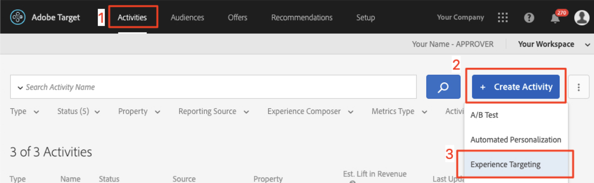
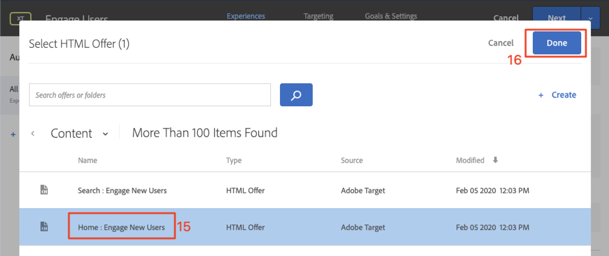

# Personalizar layouts

Agora é hora de juntar tudo e criar experiências personalizadas. Uma _Atividade_ é o mecanismo [!DNL Target] que vincula os locais, as audiências e as ofertas, de modo que, quando a solicitação for feita a partir do aplicativo, [!DNL Target] responda com o conteúdo personalizado. Criaremos duas atividades de personalização em [!DNL Target] e validaremos se o conteúdo personalizado for exibido ao usuário certo no momento certo e no local certo.

## Objetivos de aprendizagem

Ao final desta lição, você poderá:

* Criar Atividades no Adobe Target
* Validar as Atividades no aplicativo de amostra

## Criar Atividades no Adobe Target

Saiba como criar atividades Envolver usuários e Ofertas contextuais.

### Primeira Atividade - &quot;Envolver usuários&quot;

Este é um resumo da atividade que criaremos:

| Público-alvo | Localizações | Ofertas |
|---|---|---|
| Novos usuários do aplicativo móvel | weTravel_engagement_home, weTravel_ivar_search | Início: Envolva Novos Usuários, Pesquise: Envolver novos usuários |
| Retorno de usuários de aplicativos móveis | weTravel_engagement_home, weTravel_ivar_search | Início: Usuários recorrentes, default_content |

Na interface [!DNL Target], faça o seguinte:

1. Selecione **[!UICONTROL Atividade]** > **[!UICONTROL Criar Atividade]** > **[!UICONTROL Definição de metas de experiência]**.

   

1. Clique em **[!UICONTROL Aplicativo móvel]**.
1. Selecione **[!UICONTROL Compositor de formulário]**.
1. Selecione seu espaço de trabalho (o mesmo que você usou nas lições anteriores).
1. Selecione sua Propriedade (a mesma propriedade usada nas lições anteriores).
1. Clique em **[!UICONTROL Avançar]**.

   

1. Altere o título da atividade para **[!UICONTROL Envolver usuários]**.
1. Selecione **[!UICONTROL ellipsis]** > **[!UICONTROL Alterar Audiência]**.
   
1. Defina a audiência como **[!UICONTROL Novos usuários do aplicativo móvel]**.
1. Clique em **[!UICONTROL Concluído]**.
   

1. Altere o local para _weTravel_engagement_home_.
1. Selecione a seta suspensa ao lado de Conteúdo padrão e selecione **[!UICONTROL Alterar Oferta HTML]**.

   

1. Selecione **[!UICONTROL Início: Envolva a oferta Novos Usuários]**.
1. Selecione **[!UICONTROL Concluído]**.

   

1. Selecione **[!UICONTROL Adicionar Localização]**.
   

1. Selecione o local _weTravel_engagement_search_.
1. Altere a oferta HTML.

   

1. Selecione **[!UICONTROL Procurar: Envolva a oferta Novos Usuários]**.
1. Clique em **[!UICONTROL Concluído]**.

   

Você acabou de conectar uma audiência a locais e ofertas, criando a experiência personalizada para os novos usuários do aplicativo móvel! A experiência agora deve ser parecida com esta:

Agora crie uma experiência para retornar usuários de aplicativos móveis:

1. Selecione **[!UICONTROL Adicionar direcionamento de experiência]** à esquerda.
1. Selecione a Audiência **[!UICONTROL Retornando usuários do aplicativo móvel]**.
1. Selecione **[!UICONTROL Concluído]**.
   

Agora use o mesmo processo que usamos anteriormente para configurar a nova experiência. A configuração da experiência Retorno de usuários do aplicativo móvel deve ser semelhante a:

Vamos continuar para a próxima tela na configuração:

1. Clique em **[!UICONTROL Próximo]** para avançar para a tela **[!UICONTROL Definição de metas]**.
1. Use as configurações padrão para Definição de metas. Se você tiver experiências para audiências que se sobrepuseram (por exemplo, _Usuários de Nova York_ e _Usuários pela primeira vez_) você pode organizar a ordem de prioridade nesta tela.
1. Clique em **[!UICONTROL Próximo]** para avançar para **[!UICONTROL Metas e configurações]**.

   

Agora vamos concluir a configuração da atividade:

1. Defina **[!UICONTROL Objetivo primário]** como **[!UICONTROL Conversão]**.
1. Defina a ação como **[!UICONTROL Visualizada uma mbox]** > _weTravel_context_dest_ (Como esta localização está na tela de confirmação, podemos usá-la para medir as conversões).

   

1. Mantenha todas as outras configurações na tela com os padrões.
1. Clique em **[!UICONTROL Salvar e fechar]** para salvar a Atividade.
1. Ative a **[!UICONTROL Atividade]** na tela seguinte.

Nossa primeira atividade agora está pronta para ser testada!

### Segunda Atividade - &quot;Ofertas contextuais&quot;

Este é um resumo da segunda atividade que criaremos:

| Público-alvo | Localização | Ofertas |
| --- | --- | --- |
| Destino: San Diego | weTravel_context_dest | Promoção de San Diego |
| Destino: Los Angeles | weTravel_context_dest | Promoção de Los Angeles |

Repita o mesmo processo descrito acima para a próxima Atividade - &quot;Ofertas contextuais&quot;. A configuração final de ambas as experiências é mostrada abaixo:

#### San Diego

#### Los Angeles

Na etapa Metas e configurações, alteraremos o Objetivo principal para o local na tela de confirmação de reserva:

1. Em **[!UICONTROL Configurações do Relatórios]**, defina **[!UICONTROL Objetivo primário]** como **[!UICONTROL Conversão]**.
1. Defina a ação como **[!UICONTROL Visualizada uma mbox]** > _weTravel_context_dest_ (nesta atividade, essa métrica não tem significado, pois também é o mesmo local que oferece a experiência).
1. Clique em **[!UICONTROL Salvar e fechar]**.

Ative a Atividade na tela seguinte.

Agora a nossa segunda atividade está pronta para ser testada!

## Validar a Oferta inicial

Execute o Emulador e observe a primeira oferta ser exibida na parte inferior da tela inicial. Se você for um usuário recorrente com 5 ou mais inicializações de aplicativo, verá a oferta _welcome back_ exibida. Se você for um novo usuário (menos de 5 inicializações de aplicativo), deverá ver a mensagem _novo usuário_:

Se a nova oferta de usuário não for exibida, tente limpar os dados do seu emulador. Isso redefinirá as inicializações do aplicativo para 1 na próxima vez que você iniciar. Isso é feito em **[!UICONTROL Ferramentas]** > **[!UICONTROL Gerenciador AVD]**. Você também pode precisar reiniciar o Android Studio se o Logcat não funcionar corretamente:

Você também pode validar a resposta no Logcat filtrando por _weTravel_engagement_home_:

## Validar a Oferta de pesquisa

Selecione **[!UICONTROL San Jose]** como seu **[!UICONTROL Partida]** e **[!UICONTROL San Diego]** como seu **[!UICONTROL Destino]** e clique em **[!UICONTROL Localizar Barramento]** para procurar ônibus disponíveis.

Na tela de resultados, você deve ver a mensagem _use filtros_. Se você for um usuário recorrente com 5 ou mais inicializações de aplicativo, nenhuma mensagem será exibida aqui, pois o conteúdo padrão está definido para esse local (que está em branco):

## Valide as Ofertas contextuais na tela de agradecimento

Agora, prossiga com o processo de reserva:

* Selecione um barramento na tela de resultados.
* Selecione um lugar na tela de checkout.
* Selecione **[!UICONTROL Cartão de Crédito]** na tela de pagamento (deixe as informações de pagamento em branco - nenhuma reserva ocorrerá).

Como San Diego foi selecionado como destino, você deve ver o banner de oferta _DJ SAM_ na tela de confirmação:

Agora selecione **[!UICONTROL Done]** e tente fazer outra reserva com Los Angeles como destino. A tela de confirmação deve exibir o banner _Universal Studios_:

## Conclusão 

Parabéns! Isso conclui a parte principal do Adobe Target SDK 4.x para o tutorial do Android. Agora você tem as habilidades para implementar personalização em aplicativos Android! Consulte esta documentação e este aplicativo de demonstração como uma referência para seus projetos futuros.

Próximo: Sinalização de recurso é outro recurso que pode ser implementado com o Adobe Target no Android. Para saber mais sobre o sinalizador de recursos, dê uma olhada na próxima lição.

**[PRÓXIMO : Sinalização de recurso >](feature-flagging.md)**
