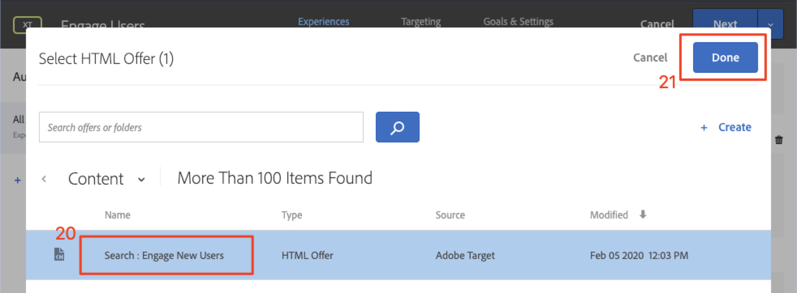

# Personalizar Layouts

Agora é hora de unir tudo e criar as experiências personalizadas. Uma _Atividade_ é o mecanismo [!DNL Target] que vincula os locais, os públicos e as ofertas, de forma que, quando a solicitação for feita pelo aplicativo, [!DNL Target] responda com o conteúdo personalizado. Criaremos duas atividades de personalização em [!DNL Target] e validaremos se o conteúdo personalizado é exibido para o usuário certo na hora certa e no local certo.

## Objetivos de aprendizagem

No final desta lição, você poderá:

* Atividades de build no Adobe Target
* Validar as atividades no aplicativo de amostra

## Criar atividades no Adobe Target

Saiba como criar atividades Engage Users e Contextual Offers.

### Primeira atividade - &quot;Envolver usuários&quot;

Aqui está um resumo da atividade que criaremos:

| Público-alvo | Localizações | Ofertas |
|---|---|---|
| Novos usuários de aplicativos móveis | wetravel_engage_home, wetravel_engage_search | Página inicial: Envolver novos usuários, Pesquisar: Envolver novos usuários |
| Retornando usuários do aplicativo móvel | wetravel_engage_home, wetravel_engage_search | Página inicial: usuários recorrentes, default_content |

Na interface [!DNL Target], faça o seguinte:

1. Selecione **[!UICONTROL Activities]** > **[!UICONTROL Create Activity]** > **[!UICONTROL Experience Targeting]**.

   

1. Clique em **[!UICONTROL Mobile App]**.
1. Selecione o **[!UICONTROL Form composer]**.
1. Selecione o espaço de trabalho (o mesmo espaço de trabalho usado nas lições anteriores).
1. Selecione sua Propriedade (a mesma propriedade usada nas lições anteriores).
1. Clique em **[!UICONTROL Next]**.

   

1. Altere o título da atividade para **[!UICONTROL Engage Users]**.
1. Selecione o **[!UICONTROL ellipsis]** > **[!UICONTROL Change Audience]**.
   
1. Defina a audiência como **[!UICONTROL New Mobile App Users]**.
1. Clique em **[!UICONTROL Done]**.
   

1. Altere a localização para _wetravel_engage_home_.
1. Selecione a seta suspensa ao lado de Conteúdo padrão e selecione **[!UICONTROL Change HTML Offer]**.

   

1. Selecione a oferta **[!UICONTROL Home: Engage New Users]**.
1. Selecione **[!UICONTROL Done]**.

   

1. Selecione **[!UICONTROL Add Location]**.
   

1. Selecione o local _wetravel_engage_search_.
1. Altere a oferta do HTML.

   

1. Selecione a oferta **[!UICONTROL Search: Engage New Users]**.
1. Clique em **[!UICONTROL Done]**.

   

Você acabou de conectar um público-alvo a locais e ofertas, criando a experiência personalizada para os Novos usuários de aplicativos móveis! A experiência agora deve ficar assim:

Agora crie uma experiência para Usuários de aplicativos móveis que retornam:

1. Selecione **[!UICONTROL Add Experience Targeting]** à esquerda.
1. Selecione o Público-alvo **[!UICONTROL Returning Mobile App Users]**.
1. Selecione **[!UICONTROL Done]**.
   

Agora use o mesmo processo usado anteriormente para configurar a nova experiência. A configuração da experiência de usuários de aplicativos móveis recorrentes deve ser semelhante a:

Vamos prosseguir para a próxima tela da configuração:

1. Clique em **[!UICONTROL Next]** para avançar para a tela **[!UICONTROL Targeting]**.
1. Use as configurações padrão para direcionamento. Se você tiver experiências com públicos sobrepostos (por exemplo, _Usuários de Nova York_ e _Usuários pela primeira vez_), poderá organizar a ordem de prioridade nesta tela.
1. Clique em **[!UICONTROL Next]** para avançar para **[!UICONTROL Goals & Settings]**.

   

Agora vamos concluir a configuração da atividade:

1. Defina o **[!UICONTROL Primary Goal]** como **[!UICONTROL Conversion]**.
1. Defina a ação como **[!UICONTROL Viewed an mbox]** > _wetravel_context_dest_ (como esse local está na tela de confirmação, podemos usá-lo para medir conversões).

   

1. Mantenha todas as outras configurações na tela de acordo com os padrões.
1. Clique em **[!UICONTROL Save & Close]** para salvar a Atividade.
1. Ativar o **[!UICONTROL Activity]** na próxima tela.

Nossa primeira atividade está ativa e pronta para ser testada.

### Segunda atividade - &quot;Ofertas contextuais&quot;

Aqui está um resumo da segunda atividade que criaremos:

| Público-alvo | Localização | Ofertas |
| --- | --- | --- |
| Destino: San Diego | wetravel_context_dest | Promoção para San Diego |
| Destino: Los Angeles | wetravel_context_dest | Promoção para Los Angeles |

Repita o mesmo processo acima para a próxima atividade - &quot;Ofertas contextuais&quot;. A configuração final de ambas as experiências é mostrada abaixo:

#### San Diego

#### Los Angeles

Na etapa Metas e configurações, alteraremos a Meta principal para o local na tela de confirmação de reserva:

1. Em **[!UICONTROL Reporting Settings]**, defina **[!UICONTROL Primary Goal]** como **[!UICONTROL Conversion]**.
1. Defina a ação como **[!UICONTROL Viewed an mbox]** > _wetravel_context_dest_ (nesta atividade, essa métrica não tem basicamente significado, pois este também é o mesmo local que fornece a experiência).
1. Clique em **[!UICONTROL Save & Close]**.

Ative a Atividade na próxima tela.

Agora, nossa segunda atividade está ativa e pronta para ser testada.

## Validar a oferta inicial

Execute o Emulador e observe a primeira oferta a ser exibida na parte inferior da tela inicial. Se você for um usuário recorrente com 5 ou mais inicializações de aplicativo, verá a oferta _bem-vindo de volta_ exibida. Se você for um novo usuário (menos de 5 inicializações de aplicativo), verá a mensagem _novo usuário_:

Se a nova oferta de usuário não for exibida, tente apagar os dados para o emulador. Isso redefinirá as inicializações do aplicativo para 1 na próxima vez que você iniciar. Isso é feito em **[!UICONTROL Tools]** > **[!UICONTROL AVD Manager]**. Talvez seja necessário reiniciar o Android Studio também, se o Logcat não funcionar corretamente:

Você também pode validar a resposta no Logcat filtrando por _wetravel_engage_home_:

## Validar a oferta de pesquisa

Selecione **[!UICONTROL San Jose]** como **[!UICONTROL Departure]** e **[!UICONTROL San Diego]** como **[!UICONTROL Destination]** e clique em **[!UICONTROL Find Bus]** para procurar barramentos disponíveis.

Na tela de resultados, você deve ver a mensagem _usar filtros_. Se você for um usuário recorrente com 5 ou mais inicializações do aplicativo, nenhuma mensagem será exibida aqui, pois o conteúdo padrão está definido para este local (que está em branco):

## Validar as ofertas contextuais na tela de agradecimento

Agora, continue com o processo de reserva:

* Selecione um barramento na tela de resultados.
* Selecione um assento na tela de check-out.
* Selecione **[!UICONTROL Credit Card]** na tela de pagamento (deixe as informações de pagamento em branco - nenhuma reserva real ocorrerá).

Como San Diego foi selecionado como destino, você deve ver o banner de oferta _DJ SAM_ na tela de confirmação:

Agora selecione **[!UICONTROL Done]** e tente outra reserva com Los Angeles como destino. A tela de confirmação deve exibir o banner _Universal Studios_:

## Conclusão 

Parabéns! Isso conclui a parte principal do tutorial do Adobe Target SDK 4.x para Android. Agora você tem as habilidades para implementar a personalização em aplicativos Android! Você pode consultar esta documentação e o aplicativo de demonstração como uma referência para seus projetos futuros.

Próximo: A Sinalização de recurso é outro recurso que pode ser implementado com o Adobe Target no Android. Para saber mais sobre a sinalização de recursos, confira a próxima lição.

**[PRÓXIMO: Sinalização de Recurso >](feature-flagging.md)**
