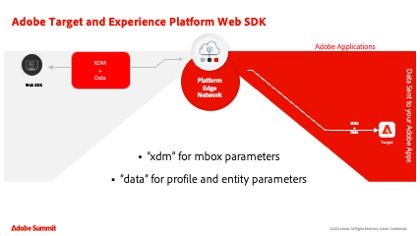
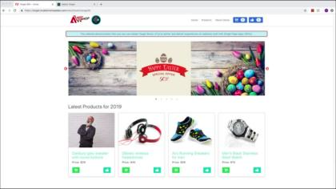

# Tutoriais do Adobe Target

O [!DNL Adobe Target] é a solução do [!DNL Adobe Experience Cloud] que oferece tudo o que você precisa para ajustar e personalizar a experiência do cliente. O [!DNL Target] ajuda a maximizar a receita em sites da Web e para dispositivos móveis, aplicativos, redes sociais e outros canais digitais. Use estes vídeos e tutoriais para saber mais sobre os vários componentes do [!DNL Adobe Target].

>[!NOTE]
>
>Além deste guia, as seguintes guias do [!DNL Adobe Target] também estão disponíveis:
>
>* *[Guia do profissional de negócios da Adobe Target](https://experienceleague.adobe.com/docs/target/using/target-home.html?lang=pt-BR){target=_blank}*
>
>* *[Guia do desenvolvedor do Adobe Target](https://experienceleague.adobe.com/docs/target-dev/developer/overview.html?lang=pt-BR){target=_blank}*

## Escolhas de pessoal

<table style="margin-top: 0 !important">
<tr>
  <td>
    
    

      <a href="https://experienceleague.adobe.com/docs/platform-learn/migrate-target-to-websdk/introduction.html?lang=pt-BR">
    <strong>Migrar o Target da at.js para a Platform Web SDK</strong>
    </a>
    

    

    <em>Saiba como migrar a implementação do at.js para o Adobe Experience Platform Web SDK.</em>
    

  </td>
  <td>
    
    

      <a href="https://experienceleague.adobe.com/docs/platform-learn/implement-in-websites/implement-solutions/target.html?lang=pt-BR">
    <strong>Implementar o Target com Tags do Adobe Experience Platform</strong>
    </a>
    

    

    <em>Saiba como implementar a extensão do Adobe Target com uma solicitação de carregamento de página e parâmetros personalizados.</em>
    

  </td>
   <td>
    
    

    <a href="https://experienceleague.adobe.com/docs/target-learn/tutorials/implementation/implement-atjs-20-in-a-single-page-application.html?lang=pt-BR">
    <strong>Implementar a at.js 2.0 em um SPA</strong>
    </a>
    

    

    <em> Saiba como implementar a at.js 2.0 (e posterior) da Adobe Target em Aplicativos de Página Única (SPA).</em>
    

  </td>
</tr>
</table>